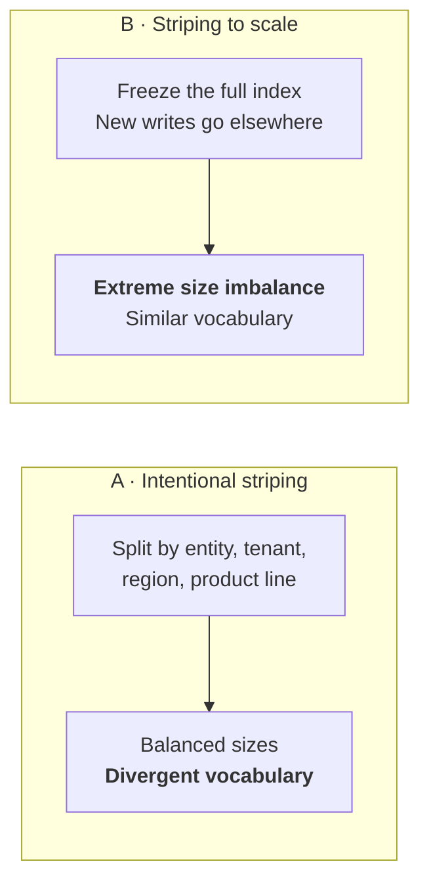
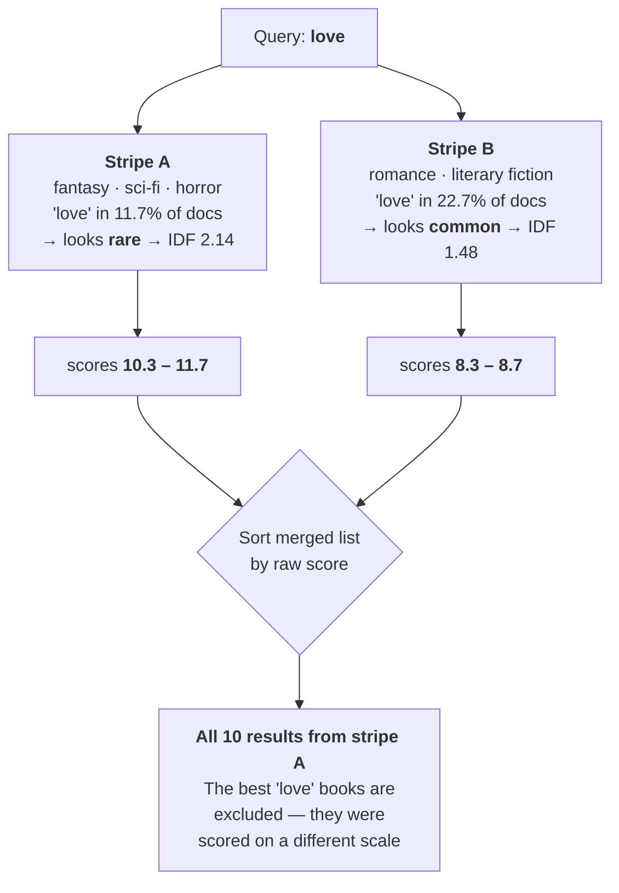

# Cross-Index Query

**You split one search corpus across two indexes. What does it cost you, and how do you get it
back?**

This repository answers that with measurements rather than assertions: 10,000 documents, 100
queries, 6,805 relevance judgments graded by two independent models, and every number reproducible
from committed data.

---

## Part 1 — Why would anyone split an index?

Almost nobody splits a search index because they want to. They do it because something forces them,
and the reasons fall into three groups.

### It no longer fits

A single Azure AI Search index has hard ceilings — **2.4 TB of storage on S3**, plus limits on
document count, and vector indexes consume space far faster than text alone. When you hit one, there
is no tuning your way out. The corpus has to live in more than one index.

This is the scenario that has no workaround, and it is the one this study is built around.

### The business requires it

| driver | why it forces a split |
| --- | --- |
| **Data residency** | EU records must stay in the EU. That is a legal boundary, not a design preference, and one index cannot straddle it. |
| **Multi-tenancy** | One index per customer gives clean isolation, clean deletion, and a blast radius of one tenant. Many SaaS products are built this way from day one. |
| **Security boundaries** | If two document populations have genuinely different access rules, keeping them physically apart is easier to defend than trusting a filter on every query. |
| **Right to be forgotten** | Deleting a tenant is dropping an index, not a long-running delete-by-query across a shared one. |

### Operations make it the sane choice

| driver | why it forces a split |
| --- | --- |
| **Different update cadences** | Live inventory changes by the minute; the ten-year archive never changes. Reindexing them together means the archive's rebuild time governs how fresh your hot data can be. |
| **Different schemas** | A CRM holds contacts, cases, opportunities and attachments. Forcing four shapes into one schema produces a wide, sparse index that serves none of them well. |
| **Cost tiering** | Recent data on a fast tier, archive on a cheap one. |
| **Independent rebuilds** | Reindex one slice without risking the others. |
| **Mergers and migrations** | Two systems came together and consolidating the indexes is a project nobody has funded yet. |

### Two shapes, and they behave differently

However you arrive, you land in one of two situations — and this distinction matters more than it
appears, because they fail in different ways and want different fixes:

**A. Intentional striping.** You planned the split along a business axis: entity type, tenant,
product line, region. The indexes end up **similar in size** but **different in vocabulary**. A
contacts index and an attachments index simply do not talk about the same things.

**B. Striping to scale.** You hit the ceiling, froze the full index, and pointed new writes at a new
one. The vocabulary drifts only slowly, but the sizes are **wildly unequal** — and that ratio moves
every day as the new index fills.



---

## Part 2 — What everybody worries about

Raise index splitting with a search team and you get the same list every time:

> *"Relevance is just going to be worse. There's no way around it."*

> *"How do I even paginate? Page 3 of a merged list isn't page 3 of anything."*

> *"My result counts will be wrong."*

> *"Two queries means twice the latency and twice the bill."*

> *"Do I now need a reranker — and do I have to pay for one?"*

The first is the big one, and it is usually stated as a certainty rather than a question. **It
deserves a number, not a shrug.** The rest are real too, and Part 7 says which of them this study
answers and which it does not.

---

## Part 3 — What actually goes wrong

Here is the thing that surprises people: the damage is not caused by splitting your data. Your
documents are unchanged, and each index ranks its own contents perfectly well.

**The damage happens in the merge.**

### The score is not a measure of the document

When you run a keyword query, Azure AI Search returns `@search.score` — a BM25 score. It is
tempting to read that as *"how good this document is."* It isn't. It is **how good this document is
relative to the other documents in that index**, and one term dominates that relationship:

> **Inverse document frequency** — how *rare* a term is. Rare terms are informative and score high.
> Common terms are uninformative and score low.

Rarity is measured against the documents in that index and nowhere else. So the moment you split a
corpus, each index develops its own private opinion about what is rare — and identical documents
start receiving different scores based on nothing but where they live.

### A worked example, from this repository's own data

Take the single most ordinary query imaginable: **`love`**.

Our corpus is split by genre. Stripe A holds fantasy, science fiction, horror, mystery, thriller,
young adult, children's and graphic novels. Stripe B holds literary fiction, romance, historical
fiction, biography, philosophy, history, self-help, humour, business, poetry and travel.

Now count where the word "love" appears:

| index | documents | contain "love" | proportion | **IDF("love")** |
| --- | ---: | ---: | ---: | ---: |
| **Stripe A** (fantasy, sci-fi, horror…) | 5,292 | 621 | **11.7%** | **2.142** |
| **Stripe B** (romance, literary fiction…) | 4,708 | 1,067 | **22.7%** | **1.484** |
| *whole corpus* | *10,000* | *1,688* | *16.9%* | *1.779* |

Stripe B is full of romance and literary fiction, so "love" is ordinary there — and BM25 correctly
concludes that, *within stripe B*, the word tells you little. Stripe A finds it rarer and treats it
as more informative.

The result is that **every stripe B document is scored roughly 30% lower for exactly the same
match.** Watch what the two indexes return:

<table>
<tr><th>Stripe A — top 5</th><th>Stripe B — top 5</th></tr>
<tr><td>

| # | title | score |
| --- | --- | ---: |
| 1 | Loves Music, Loves to Dance | **11.69** |
| 2 | Fallen in Love | **11.23** |
| 3 | Love You Forever | **11.13** |
| 4 | Geek Love | **11.13** |
| 5 | How to Love | **11.13** |

</td><td>

| # | title | score |
| --- | --- | ---: |
| 1 | The Four Loves | 8.74 |
| 2 | Someone to Love | 8.58 |
| 3 | The History of Love | 8.52 |
| 4 | First Love | 8.50 |
| 5 | On Love | 8.50 |

</td></tr>
</table>

Every score in the left column beats every score in the right column. So if you merge by sorting on
score — the obvious thing, and the thing most people write first — **you get ten results from
stripe A and none at all from stripe B.**

Now compare that against what a single index holding all 10,000 documents returns for the same
query:

| # | single-index top 10 for `love` | judged relevance |
| --- | --- | :---: |
| 1 | The Four Loves | **3** |
| 2 | Someone to Love | **3** |
| 3 | The History of Love | **3** |
| 4 | First Love | **3** |
| 5 | On Love | **3** |
| 6 | P.S. I Love You | **3** |
| 7 | Loves Music, Loves to Dance | 1 |
| 8 | Love Story | **3** |
| 9 | Conquer Your Love | **3** |
| 10 | Ugly Love | **3** |

**Nine of the single index's ten best results are the documents naive merging threw away.**
Meanwhile the naive merge puts *Loves Music, Loves to Dance* — graded **1** — at position 1, and
fills the rest with titles like *Guess How Much I Love You*, a children's board book.

Measured on judged relevance: **naive merge 0.66, single index 0.94.**

And the fixes in Part 4? On this query, both score a **perfect 1.00** — they recover every one of
stripe B's documents *and* order them better than the single index did, because they can see
candidates from both halves of the corpus at once.

### The generalisation

That example contains the whole problem in miniature:

> **Naive score merging is biased toward whichever index knows *least* about your query.**

The index with fewer matching documents thinks your term is rarer, scores it higher, and wins the
merge. It is not surfacing better documents — it is surfacing documents from the index with less
competition. The more specialised your split, the stronger the bias.



### It is not only IDF

Three more things break in the same way, and they are worth knowing before you debug the wrong one:

- **Average document length.** BM25 normalises by how long a document is *relative to the average
  in that index*. Split contacts (40 words) from attachments (4,000 words) and the two indexes
  disagree about what "long" means. Our corpus has uniform document lengths so this effect is small
  here — **in a real heterogeneous corpus it may be larger than the IDF effect.**
- **Hybrid scores are already fused.** A hybrid query returns a *Reciprocal Rank Fusion* score
  computed inside one index. The underlying magnitudes are gone, so you cannot correctly re-fuse
  them across indexes. Hybrid is the worst mode for naive merging, which surprises people because
  hybrid is what most of them run.
- **Paging and counts genuinely do not compose.** Page 3 of a merged list is not page 3 of either
  index, and `@odata.count` from two indexes cannot simply be added if the ranking is global. These
  are real problems and this study does **not** solve them; see Part 7.

### What is *not* affected

**Vector search has none of this.** Cosine similarity is a property of two vectors — the query's and
the document's. No corpus statistics enter into it, so a similarity of 0.83 means the same thing in
every index.

We measured merged vector results against a single index at **Kendall τ = 1.000 on every one of the
100 queries** — not an average, an exact rank match every time. If your workload is vector-only,
splitting your index is free, and you can stop reading.

---

## Part 4 — So how much does it actually cost?

Here is where the common wisdom turns out to be half right.

| what you do when merging | keyword nDCG vs a single index | |
| --- | ---: | --- |
| Merge on **ranks** (RRF, interleave) | **−0.061 to −0.081** | the worst option measured |
| Merge on **raw scores** | −0.015 to −0.002 | small, and judge-dependent |
| Merge on **corrected scores** | **+0.013 to +0.016** | free |
| **Recompute BM25** client-side | **+0.096 to +0.102** | free |
| **Rerank** on either side | **parity** | costs nothing extra |
| **Vector-only** workloads | **parity** (τ = 1.000) | exactly free |

Ranges span two independent judges; **26 of 27 conclusions were identical under both**.

Three things stand out, and the first is the one most likely to change what you do:

**Rank fusion is the worst thing you can do, and it is the standard advice.** Reciprocal Rank Fusion
is what gets recommended for merging across indexes, precisely because it sidesteps incomparable
score scales by throwing the scores away. But a rank carries no information about how many documents
it was drawn from — rank 1 of 19 documents ties rank 1 of 9,981. It loses **four to five times more**
than the naive merge everyone worries about, and it fails in vector mode too, where there was
nothing wrong with the scores to begin with.

**The naive merge is a smaller problem than its reputation.** Real, directionally negative, and at
the edge of what this study can resolve — one of the two judges scored it as indistinguishable from
not splitting at all. Worth fixing because the fix is free, not because it is an emergency.

**The fixes are arithmetic, and they can beat a single index.** Both repairs use a small statistics
file you build once offline. No model, no extra queries, no tier upgrade — and recomputing BM25
client-side scored **+0.096 above** the un-split baseline, winning on 74 of 100 queries.

> **Why can splitting ever beat *not* splitting?** Not because the scoring improved — it is the same
> BM25 on both sides. It is candidate selection. A single index spends its top-50 on whatever scores
> highest globally, which for a broad query can be dominated by one theme. Splitting *guarantees*
> candidate slots to each part of the corpus, and correcting the scores makes that diversity usable.
> The effect concentrates in queries whose answers span both indexes, exactly as that explanation
> predicts.

## → **[Read the full report](docs/report.md)**

Method, both scenarios, all four patterns priced, per-query significance testing, and a frank
threats-to-validity section.

---

## Part 5 — How this was measured

Claims about relevance are easy to make and hard to check, so here is the apparatus.

**Three indexes, not two.** Two stripes, plus an **oracle** index holding all 10,000 documents. The
oracle is the un-split baseline — without it, "how much did splitting cost?" has no answer. Identical
schema, analyzer and vector profile across all three, so any difference is attributable to the split
and nothing else.

**Two metrics, because one is not enough.**

- *Fidelity* asks **did the merged list reproduce what one index would have returned?** Right
  question for measuring loss — but it defines the single index as correct, so a merge that surfaces
  something genuinely better is scored as an error.
- *Judged relevance* removes that blind spot. We pooled the top-10 from every strategy and both arms
  into **6,805 unique (query, document) pairs** and had each graded 0–3, blind to which system
  produced it. The single index becomes just another system, and can lose.

The two disagreeing is informative in itself: client-side BM25 recomputation scores **worst but one**
on fidelity and **best overall** on judged relevance. It departs from the single-index ranking
substantially, and the departure is an improvement.

**The judge was itself checked.** All 6,805 pairs were re-graded by a second, different model and
every conclusion recomputed. Agreement was substantial (weighted Cohen's κ = 0.735), and 26 of 27
conclusions held. The one that moved is flagged wherever it appears.

**Significance.** Paired per-query two-sided t-tests, n=100, with win/loss counts reported alongside
means. The raw per-query data behind every published number is committed in [`results/`](results).

---

## Part 6 — The four ways to merge

Ordered by what they cost you at query time.

| # | pattern | who does the ranking | extra queries | extra bill | measured p50 |
| --- | --- | --- | --- | --- | ---: |
| **1** | [**Query only**](samples/Pattern1_QueryOnly.cs) | your code — arithmetic | none | **none** | **54 ms** |
| **2** | [Self-rerank, external](samples/Pattern2_ExternalRerank.cs) | a model you host | none | your model | 21,792 ms |
| **3** | [Built-in semantic ranker](samples/Pattern3_SemanticRanker.cs) | the service | none | semantic meter | 157 ms |
| **4** | [Agentic retrieval](samples/Pattern4_AgenticRetrieval.cs) | the service, end to end | replaces yours | agentic meter | 327 ms |

Each sample is a small, readable file that shows the merge itself — including the wrong ways, with
comments explaining why they are wrong.

**Pattern 1 is the answer for most people.** It needs one precomputed statistics file and no
query-time cost at all, and it measured *better* than not splitting.

**Patterns 3 and 4 reach statistical parity** with a single index (p = 0.24–0.49). If you already
pay for reranking, splitting costs you nothing measurable — but note the reason: a cross-encoder
scores (query, document) pairs and never consults corpus statistics, so there is nothing for a split
corpus to distort.

**Keep the comparison honest.** Reranking is worth about **+0.19 nDCG** on its own — an order of
magnitude more than anything splitting does to you in either direction. It improves a single index
by just as much, so it is never an argument *for* splitting. If relevance is your problem, that is
where the leverage is.

---

## Part 7 — What this does and does not answer

**Answered:** how much relevance you lose merging two indexes, which merge strategies recover it,
what each costs in queries, compute units and latency, and how the answer changes with size
imbalance.

**Not answered, and worth knowing:**

- **Paging.** Deep paging across merged indexes is a genuinely hard problem — you must over-fetch
  from every index to guarantee a correct page *n*, and cost grows with depth. Not addressed here.
- **Total counts.** Merged result counts are approximate once ranking is global. Not addressed here.
- **More than two indexes.** Everything here is N=2. Rank fusion's failure should get *worse* with
  more indexes, since each one can contribute its locally-inflated best non-answer. Untested.
- **Real scale.** 10,000 documents, not 2.4 TB. The core distortion is scale-invariant — IDF
  divergence depends on the *ratio* of term densities, not absolute counts — but candidate-window
  effects at true scale are untested.
- **Heterogeneous document lengths.** Our corpus is uniform, so the length-normalisation half of
  BM25 barely diverges. A corpus split by entity type would likely see this matter more, and the
  corrections shown here address only the IDF half.
- **Human relevance judgments.** Ours are model-generated, cross-checked by a second model but not by
  people. Both models share a family, so a bias common to that family would be invisible.
- **Relevance tuning.** No scoring profiles, no field boosting. Those are orthogonal — you would
  apply the same profile to every index — but it means these numbers describe splitting in isolation,
  not a tuned production system.

---

## Running it

Prerequisites: .NET 10 SDK, an Azure AI Search service, an Azure OpenAI deployment of
`text-embedding-3-small`, and `az login`. Authentication is `DefaultAzureCredential` throughout —
there are no API keys in this repository and none should be added.

```powershell
Copy-Item appsettings.Development.json.example appsettings.Development.json
#   ...then edit the two endpoints

dotnet build                                                        # 0 warnings
dotnet test                                                         # 48/48

dotnet run --project src/CrossIndexQuery.Cli -- doctor              # verify the environment
dotnet run --project src/CrossIndexQuery.Cli -- init                # build the three indexes
dotnet run --project src/CrossIndexQuery.Cli -- query "love" --explain
dotnet run --project src/CrossIndexQuery.Cli -- evaluate            # reproduce the matrix
```

`query --explain` is the teaching surface — it prints what each index returned, what it scored, and
how the merge transformed it. The `love` example in Part 3 is exactly that command's output.

Switch scenarios with configuration alone:

```powershell
$env:CIQ_Corpus__StripeMode = 'Genre'       # intentional split - balanced, divergent vocabulary
$env:CIQ_Corpus__StripeMode = 'Temporal'    # split to scale - imbalanced, drifting vocabulary
$env:CIQ_Corpus__StripeYearCut = '2013'     #   ...at 9.4:1 imbalance
$env:CIQ_Corpus__StripeMode = 'Random'      # the control - no divergence, no imbalance
```

## What's here

| | |
| --- | --- |
| **[`docs/report.md`](docs/report.md)** | The full study. |
| **[`samples/`](samples/)** | Four readable programs, one per merge pattern. |
| [`src/CrossIndexQuery.Core`](src/CrossIndexQuery.Core) | Retrieval, the fusion catalog, metrics, evaluation harness. |
| [`src/CrossIndexQuery.Cli`](src/CrossIndexQuery.Cli) | `doctor`, `init`, `query`, `evaluate`. |
| [`src/CrossIndexQuery.DataPrep`](src/CrossIndexQuery.DataPrep) | Offline corpus pipeline and relevance-judging harness. |
| [`data/`](data) | Committed corpus, query set, corpus statistics, relevance judgments. See [`DATA.md`](DATA.md). |
| [`results/`](results) | Per-query output behind every published number. |
| [`infra/`](infra) | azd + Bicep for a one-command environment. |
| [`docs/decisions.md`](docs/decisions.md) | What was measured, what was predicted wrongly, and why. |

> **The corpus contains AI-generated text.** The book descriptions are model-generated, not real
> publisher blurbs, and may contain factual errors about the books they describe. The relevance
> judgments are model-generated rather than human. The corpus also derives from a CC BY-SA 4.0
> dataset, so `data/` is licensed differently from the code. See **[`DATA.md`](DATA.md)** before
> reusing anything in `data/`.

## The corpus

**10,000 books** with model-generated ~120-word descriptions and `text-embedding-3-small` vectors,
committed in `data/books.enriched.json` so the sample runs without a generation step. Derived from
[goodbooks-10k](https://github.com/zygmuntz/goodbooks-10k) (CC BY-SA 4.0).

Vectors are stored as base64 int8 rather than decimal text — 30 MB instead of 192 MB, at a measured
cost of 0.10% recall@10. Read the corpus through `CorpusFile`; a bare `JsonSerializer` will not
decode them.

## Contributing

See [`CONTRIBUTING.md`](CONTRIBUTING.md). Adding a fusion strategy is deliberately cheap: strategies
are pure functions with no Azure dependency, so a new one can be written and unit-tested entirely
offline, and it joins the evaluation matrix automatically.

If you think a published number is wrong, the per-query data behind all of them is in
[`results/`](results) — open an issue with the specific comparison.

## Licence

Code, documentation and results: [MIT](LICENSE).
Data under `data/`: [CC BY-SA 4.0](https://creativecommons.org/licenses/by-sa/4.0/), inherited from
[goodbooks-10k](https://github.com/zygmuntz/goodbooks-10k). See [`DATA.md`](DATA.md).

## Trademarks

This project may contain trademarks or logos for projects, products, or services. Authorized use of
Microsoft trademarks or logos is subject to and must follow
[Microsoft's Trademark & Brand Guidelines](https://www.microsoft.com/legal/intellectualproperty/trademarks/usage/general).
Use of Microsoft trademarks or logos in modified versions of this project must not cause confusion
or imply Microsoft sponsorship. Any use of third-party trademarks or logos is subject to those
third-party's policies.
