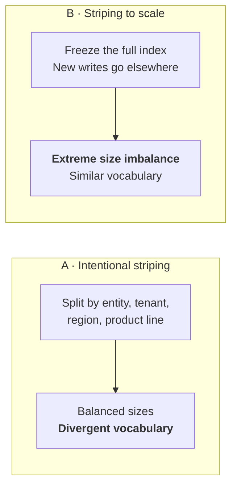
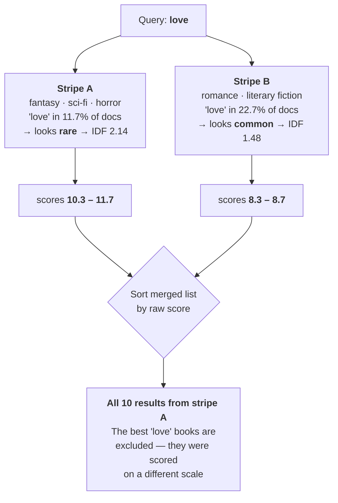

# Techniques for Cross-Index Query Optimization

Sometimes data can't all live in one index. The corpus outgrows a single index. EU records have to
stay in the EU. Each tenant gets its own index for isolation. Two systems merged and the
consolidation project hasn't been funded yet.

Whatever the reason, you end up with one logical body of content spread across two Azure AI Search
indexes — sometimes in two services or two regions — and users who still expect one ranked list.

**An Azure AI Search query targets a single index.** So the way to search a corpus that spans two of
them is to send the query to each, get two result sets back, and merge them into one. That merge is
what this repository is about: how much relevance it costs, which merging strategies get it back,
and what each one costs in latency, extra queries, and billing.

Every number here comes from a reproducible experiment — 10,000 documents, 100 queries, 6,805
relevance judgments graded by two independent models — with the per-query data committed alongside
the code.

### The common concerns

Relevance will be worse. Paging won't work. Result counts will be wrong. Two queries means twice the
cost. And you'll probably need a reranker.

Relevance is the big one, and it's usually stated as a certainty. It deserves a number instead. This
study measures relevance and cost. It does not solve paging or counts, and [Part 5](#part-5--what-this-does-and-doesnt-answer)
says so plainly.

### What actually breaks

Splitting the data does nothing to the data. Each index ranks its own contents correctly.

The problem shows up when you combine the two lists, because **a BM25 score isn't a property of the
document — it's a property of the document relative to everything else in that index.** Two indexes
with different vocabularies score on different scales, and sorting the merged list by score quietly
favors whichever index knows *least* about your query.

Vector similarity has none of this problem. If your workload is vector-only, splitting is free, and
the measurements here confirm it exactly.

### Where we land

- **Rank fusion (RRF) — the usual advice for merging incomparable scores — is the worst option
  measured.** It loses four to five times more than the naive score merge everyone worries about.
- **The naive score merge is a smaller problem than its reputation.** Real and negative, but small.
- **The fix is arithmetic.** A statistics file built once offline lets you correct or recompute
  scores client-side, with no model, no extra queries, and no tier change. Done well, the split
  becomes undetectable: **+0.005 nDCG against the unsplit corpus, p = 0.28**, with most queries
  returning an identical top-10. And if you already pay for reranking, splitting costs nothing
  measurable.
- **We ran the controls that could have proven us wrong, and one of them did.** An earlier version
  of this study claimed splitting could *beat* not splitting. A control showed that gain was a
  change of scorer rather than anything to do with splitting. The claim was withdrawn, the control
  ships enabled, and [the correction is documented](docs/report.md#the-controls) rather than
  quietly edited out.

### What's in the repo

Three indexes — two stripes plus a single-index baseline to measure against. Four merge patterns as
small readable sample programs, including the wrong ways with comments explaining why. A
`query --explain` command that shows what each index returned and how the merge transformed it.
Three stripe modes for switching between an intentional split and a split-to-scale. And the full
report, with significance testing and a threats-to-validity section.

## → **[Read the full report](docs/report.md)**

---

## Part 1 — How data ends up in more than one index

Almost nobody splits a search index because they want to. Something forces it.

### It no longer fits

A single index has hard ceilings — **2.4 TB of storage on S3**, plus limits on document count. Vector
indexes eat that space far faster than text alone. When you hit one, there's no tuning your way out.

This is the scenario with no workaround, and it's the one this study is built around.

### The business requires it

| scenario | why one index won't do |
| --- | --- |
| **Data residency** | EU records stay in the EU. That's a legal boundary, not a design preference, and one index can't straddle it. |
| **Multi-tenancy** | An index per customer gives clean isolation, clean deletion, and a blast radius of one tenant. |
| **Security boundaries** | When two document populations have genuinely different access rules, keeping them physically apart is easier to defend than trusting a filter on every query. |
| **Right to be forgotten** | Offboarding a tenant is dropping an index — not a long-running delete-by-query against a shared one. |

### Operations make it the sane choice

| scenario | why one index won't do |
| --- | --- |
| **Different update cadences** | Live inventory changes by the minute; the ten-year archive never changes. Reindex them together and the archive's rebuild time governs how fresh your hot data can be. |
| **Different schemas** | A CRM holds contacts, cases, opportunities, and attachments. Force four shapes into one schema and you get a wide, sparse index that serves none of them well. |
| **Cost tiering** | Recent data on a fast tier, archive on a cheap one. |
| **Independent rebuilds** | Reindex one slice without risking the others. |
| **Mergers and migrations** | Two systems came together. Consolidating the indexes is a project nobody has funded. |

### Two shapes, and they fail differently

However you get there, you land in one of two situations. The distinction matters more than it
looks, because they break in different ways and want different fixes.

**A. Intentional striping.** You planned the split along a business axis — entity type, tenant,
product line, region. The indexes end up **similar in size** but **different in vocabulary**. A
contacts index and an attachments index don't talk about the same things.

**B. Striping to scale.** You hit the ceiling, froze the full index, and pointed new writes at a new
one. Vocabulary drifts slowly, but the sizes are **wildly unequal** — and that ratio moves every day
as the new index fills.



Both are measured here. You switch between them with one environment variable.

### If the indexes are in different services

Everything above still applies, plus three things. Latency becomes the slower of two round trips
rather than two calls to the same front door. Compute is billed separately per service. And
**agentic retrieval is off the table** — a knowledge base references indexes within one service, so
[pattern 4](#part-4--the-four-ways-to-merge) needs them co-located. Patterns 1 through 3 work across
services unchanged.

---

## Part 2 — What actually goes wrong

The mechanism, then a worked example from this repository's own data.

### The score measures the neighborhood, not the document

A BM25 score leans heavily on one quantity:

> **Inverse document frequency** — how *rare* a term is. Rare terms are informative and score high.
> Common terms are uninformative and score low.

Rarity is measured against the documents in that index and nowhere else. Split a corpus and each
index develops its own private opinion about what's rare. Identical documents start getting
different scores based on nothing but where they live.

### A worked example: searching for `love`

Take the most ordinary query imaginable. Our corpus is split by genre — stripe A holds fantasy,
sci-fi, horror, mystery, thriller, YA, children's, and graphic novels; stripe B holds literary
fiction, romance, historical fiction, biography, philosophy, history, self-help, humor, business,
poetry, and travel.

Count where the word "love" actually appears:

| index | documents | contain "love" | proportion | **IDF("love")** |
| --- | ---: | ---: | ---: | ---: |
| **Stripe A** — fantasy, sci-fi, horror… | 5,292 | 621 | **11.7%** | **2.142** |
| **Stripe B** — romance, literary fiction… | 4,708 | 1,067 | **22.7%** | **1.484** |
| *whole corpus* | *10,000* | *1,688* | *16.9%* | *1.779* |

Stripe B is full of romance, so "love" is ordinary there. BM25 correctly concludes that *within
stripe B* the word tells you little — and scores every stripe B document about 30% lower for exactly
the same match.

Watch what comes back:

<table>
<tr><th>Stripe A — top 5</th><th>Stripe B — top 5</th></tr>
<tr><td>

| # | title | score |
| --- | --- | ---: |
| 1 | Loves Music, Loves to Dance | **11.69** |
| 2 | Fallen in Love | **11.23** |
| 3 | Love You Forever | **11.13** |
| 4 | Geek Love | **11.13** |
| 5 | How to Love | **11.13** |

</td><td>

| # | title | score |
| --- | --- | ---: |
| 1 | The Four Loves | 8.74 |
| 2 | Someone to Love | 8.58 |
| 3 | The History of Love | 8.52 |
| 4 | First Love | 8.50 |
| 5 | On Love | 8.50 |

</td></tr>
</table>

Every score on the left beats every score on the right. Sort the merged list by score — the obvious
thing, and the thing most people write first — and **you get ten results from stripe A and none at
all from stripe B.**

Here's what a single index holding all 10,000 documents returns for the same query:

| # | single-index top 10 for `love` | judged relevance |
| --- | --- | :---: |
| 1 | The Four Loves | **3** |
| 2 | Someone to Love | **3** |
| 3 | The History of Love | **3** |
| 4 | First Love | **3** |
| 5 | On Love | **3** |
| 6 | P.S. I Love You | **3** |
| 7 | Loves Music, Loves to Dance | 1 |
| 8 | Love Story | **3** |
| 9 | Conquer Your Love | **3** |
| 10 | Ugly Love | **3** |

**Nine of the ten best results are the documents naive merging threw away.** In their place it puts
*Loves Music, Loves to Dance* — graded **1** — at position 1, and fills the rest with titles like
*Guess How Much I Love You*, a children's board book.

Judged relevance: **naive merge 0.66, single index 0.94.**

And the fixes? On this query both score a **perfect 1.00** — recovering every one of stripe B's
documents *and* ordering them better than the single index managed, because they can see candidates
from both halves of the corpus at once.

### The generalization

> **Naive score merging is biased toward whichever index knows least about your query.**

The index with fewer matching documents thinks your term is rarer, scores it higher, and wins the
merge. It isn't surfacing better documents — it's surfacing documents that had less competition. The
more specialized your split, the stronger the bias.

### See it for yourself

Both halves of that example are one command each:

```powershell
# The mistake - watch the stripe mix come back a=10, b=0
dotnet run --project src/CrossIndexQuery.Cli -- query "love" --strategy naive-score --explain

# The fix - same two queries, same cost, stripe mix a=1, b=9
dotnet run --project src/CrossIndexQuery.Cli -- query "love" --strategy global-bm25
```

`--explain` prints what each index returned and what it scored before the merge, so you can watch
one document outrank another on a number that was never comparable.

**Or check our numbers without an Azure subscription at all.** Every per-query score in this study
is committed as CSV, and `compare` re-runs the statistics on them offline and for free:

```powershell
# The headline claim, and the control that cut it down
dotnet run --project src/CrossIndexQuery.Cli -- compare `
  --results results/results.genre.lexical.csv --candidate global-bm25

# The comparison that actually isolates splitting: same rescorer, split vs not
dotnet run --project src/CrossIndexQuery.Cli -- compare `
  --results results/results.genre.lexical.csv `
  --baseline single-index-rescored --candidate global-bm25
```

That second command prints `+0.0045`, a 95% interval of `[-0.0034, +0.0129]`, and `p = 0.284` — the
measured cost of splitting the corpus, once nothing else differs.



### Three more things break the same way

- **Average document length.** BM25 normalizes by how long a document is *relative to the average in
  that index*. Split contacts (40 words) from attachments (4,000 words) and the two disagree about
  what "long" means. Our corpus has uniform lengths, so this barely registers here — **in a real
  heterogeneous corpus it may matter more than the IDF effect.**
- **Hybrid scores are already fused.** A hybrid query returns an RRF score computed inside one index.
  The underlying magnitudes are gone, so you can't correctly re-fuse across indexes. Hybrid is the
  worst mode for naive merging — which catches people out, because hybrid is what most of them run.
- **Paging and counts genuinely don't compose.** Page 3 of a merged list isn't page 3 of either
  index. This study doesn't solve that; see [Part 5](#part-5--what-this-does-and-doesnt-answer).

### What isn't affected

**Vector search has none of this.** Cosine similarity is a property of two vectors — the query's and
the document's. No corpus statistics enter into it, so 0.83 means the same thing in every index.

We measured merged vector results against a single index at **Kendall τ = 1.000 on every one of the
100 queries.** Not an average — an exact rank match, every time.

One honest footnote, because it's the kind of number that gets misread. Against HNSW — the
approximate algorithm that vector indexes actually use — the merged list scores 0.974 nDCG rather
than 1.000. That is *not* a splitting cost. τ is still exactly 1.000, so nothing was reordered; a
few documents simply never became candidates, because walking two proximity graphs of 5,000
documents doesn't visit the same neighbors as walking one graph of 10,000. Re-run with exact search
and the gap disappears completely: **1.000 fidelity, 1.000 recall, identical judged score.**

```powershell
$env:CIQ_Evaluation__ExhaustiveVectorSearch='true'
dotnet run --project src/CrossIndexQuery.Cli -- evaluate --modes Vector
```

---

## Part 3 — What it costs, and what gets it back

| what you do when merging | keyword nDCG vs a single index | |
| --- | ---: | --- |
| Merge on **ranks** (RRF, interleave) | **−0.061 to −0.081** | the worst option measured |
| Merge on **raw scores** | −0.015 to −0.002 | small, and judge-dependent |
| Merge on **corrected scores** | **+0.013 to +0.016** | free |
| **Recompute BM25** client-side | **parity** (+0.005, p = 0.28) | free, and the split disappears |
| **Rerank** on either side | **parity** | costs nothing extra |
| **Vector-only** workloads | **identical** (τ = 1.000) | provably free |

Ranges span two independent judges. **26 of 27 conclusions were identical under both.**

**Rank fusion is the worst thing you can do, and it's the standard advice.** RRF gets recommended for
cross-index merging precisely because it sidesteps incomparable scales — by throwing the scores away.
But a rank says nothing about how many documents it was drawn from: rank 1 of 19 ties rank 1 of
9,981. It loses four to five times more than the naive merge, and it fails in vector mode too, where
the scores were already perfectly comparable.

**The naive merge is smaller than its reputation.** Directionally negative, and right at the edge of
what this study can resolve — one of the two judges scored it as indistinguishable from not
splitting at all. Fix it because the fix is free, not because it's an emergency.

**Recomputing the scores makes the split vanish.** Rebuild BM25 client-side from corpus-wide
statistics and the split becomes undetectable: **+0.005 nDCG, p = 0.28**, with 59 of 100 queries
returning a byte-identical top-10 to the unsplit corpus. Not "an acceptable loss" — no measurable
loss at all.

> **A correction we left in.** An earlier version of this README claimed that splitting could *beat*
> not splitting, at +0.096 nDCG. That was wrong, and the way it was wrong is instructive.
>
> The strategy changed two things at once: it repaired the cross-index statistics, and it replaced
> the service's scoring with our own client-side BM25. Only the first has anything to do with
> splitting. When we finally ran the obvious control — the *same* rescorer applied to the *unsplit*
> index — it scored +0.092 on its own. Almost the entire "benefit of splitting" was a scoring change
> that had nothing to do with splitting, and would have helped a single index just as much.
>
> The honest number is +0.005, which is nothing. That is a better answer anyway: you don't need
> splitting to be *good*, you need it to be *free*, and it is. Both controls now run by default, and
> [the report](docs/report.md#the-controls) shows the decomposition.

---

## Part 4 — The four ways to merge

Ordered by what they cost you at query time.

| # | pattern | who ranks | extra queries | extra bill | measured p50 |
| --- | --- | --- | --- | --- | ---: |
| **1** | [**Query only**](samples/Pattern1_QueryOnly.cs) | your code — arithmetic | none | **none** | **55 ms** |
| **2** | [Self-rerank, external](samples/Pattern2_ExternalRerank.cs) | a model you host | none | your model | 23,028 ms |
| **3** | [Built-in semantic ranker](samples/Pattern3_SemanticRanker.cs) | the service | none | semantic meter | 151 ms |
| **4** | [Agentic retrieval](samples/Pattern4_AgenticRetrieval.cs) | the service, end to end | replaces yours | ~18.5k tokens/query | 1,976 ms |

Each sample is a small file showing the merge itself — including the wrong ways, with comments
explaining why they're wrong.

**Pattern 1 is the answer for most people.** One precomputed statistics file, no query-time cost, and
the split becomes undetectable.

**Pattern 3 reaches exact parity** with a single index (Holm p = 1.000, 32 of 100 queries returning
an identical list). If you already pay for reranking, splitting costs nothing measurable — and the
reason is structural: a cross-encoder scores (query, document) pairs and never consults corpus
statistics, so a split corpus has nothing to distort.

> **Pattern 4 has a trap worth knowing about.** Agentic retrieval produced both the **best** result
> in this study and the **worst**, separated by a single configuration property.
>
> | `resultsProcessing` | how it merges | tokens | judged nDCG |
> | --- | --- | ---: | ---: |
> | `rerank` *(default)* | semantic cross-encoder score | 18,500 | **0.783** |
> | `none` | **round-robin interleave** | **0** | **0.457** |
>
> A 0.326 gap (94 of 100 queries). It's tempting to use agentic retrieval as a *free* cross-index
> merge engine — set `resultsProcessing: none` and it costs zero model tokens. Don't. With no
> comparable score to sort by, the service falls back to round-robin across sources, which is
> interleaving — the worst merge in this entire report.
>
> Also worth knowing: despite the name, **no LLM ranks anything here** unless you attach a model to
> the knowledge base. It's the same semantic ranker pattern 3 uses. And `maxOutputDocuments`
> (range **50–200**, default 25) is silently capped by `maxOutputSize` — ask for 200 without raising
> both and you get ~49, with no error.

**Keep the comparison honest.** Reranking is worth about **+0.19 nDCG** on its own — an order of
magnitude more than anything splitting does to you in either direction. It improves a single index
by just as much, so it's never an argument *for* splitting. If relevance is your problem, that's
where the leverage is.

---

## Part 5 — What this does and doesn't answer

**Answered:** how much relevance you lose merging two indexes, which strategies recover it, what each
costs in queries, compute units and latency, and how the answer shifts with size imbalance.

**Not answered:**

- **Paging.** Deep paging across merged indexes is genuinely hard — you must over-fetch from every
  index to guarantee a correct page *n*, and cost grows with depth.
- **Total counts.** Merged counts are approximate once ranking is global.
- **More than two indexes.** Everything here is N=2. Rank fusion should get *worse* with more, since
  each index can contribute its locally-inflated best non-answer.
- **Real scale.** 10,000 documents, not 2.4 TB. The core distortion is scale-invariant — IDF
  divergence depends on the *ratio* of term densities, not absolute counts — but candidate-window
  effects at true scale are untested.
- **Heterogeneous document lengths.** Our corpus is uniform, so the length-normalization half of BM25
  barely diverges. The corrections here address only the IDF half.
- **Human relevance judgments.** Ours are model-generated, cross-checked by a second model but not by
  people. Both models share a family, so a bias common to that family would be invisible.
- **Relevance tuning.** No scoring profiles, no field boosting. Those are orthogonal — you'd apply
  the same profile to every index — but these numbers describe splitting in isolation, not a tuned
  production system.

---

## How this was measured

**Three indexes, not two.** Two stripes plus an **oracle** holding all 10,000 documents. The oracle
is the un-split baseline — without it, "how much did splitting cost?" has no answer. Identical
schema, analyzer, and vector profile across all three, so any difference is attributable to the
split and nothing else.

**Two metrics, because one isn't enough.** *Fidelity* asks whether the merged list reproduced what
one index would have returned — the right question for measuring loss, but it defines the single
index as correct, so a merge that surfaces something genuinely better is scored as an error.
*Judged relevance* removes that blind spot: we pooled the top-10 from every strategy and both arms
into 6,805 unique (query, document) pairs and had each graded 0–3, blind to which system produced it.

The two disagreeing is informative. Client-side BM25 recomputation scores second-worst on fidelity
and best overall on judged relevance — it departs from the single-index ranking substantially, and
the departure is an improvement.

**The judge was itself checked.** All 6,805 pairs were re-graded by a second model and every
conclusion recomputed. Agreement was substantial (weighted Cohen's κ = 0.735), and 26 of 27
conclusions held. The one that moved is flagged wherever it appears.

**Significance.** Paired per-query two-sided t-tests, n=100, with win/loss counts alongside means.
Raw per-query data for every published number is in [`results/`](results).

## Running it

Prerequisites: .NET 10 SDK, an Azure AI Search service, an Azure OpenAI deployment of
`text-embedding-3-small`, and `az login`. Authentication is `DefaultAzureCredential` throughout —
no API key is needed to run anything in this study.

```powershell
Copy-Item .env.example .env
#   ...then fill in the two endpoints. Every other setting has a working default.

dotnet build                                                        # 0 warnings
dotnet test                                                         # 88/88

dotnet run --project src/CrossIndexQuery.Cli -- doctor              # verify the environment
dotnet run --project src/CrossIndexQuery.Cli -- init                # build the three indexes
dotnet run --project src/CrossIndexQuery.Cli -- query "love" --explain
dotnet run --project src/CrossIndexQuery.Cli -- evaluate            # reproduce the matrix
```

`.env` is git-ignored and feeds the environment layer, so anything in it overrides the JSON
settings files — and a variable exported in your shell still overrides the file, so one-off runs
work as expected. [`.env.example`](.env.example) documents every setting, including which ones you
only need if you are provisioning resources rather than pointing at an existing service.

`query --explain` is the teaching surface — it prints what each index returned, what it scored, and
how the merge transformed it. The `love` example in Part 2 is that command's output.

Switch scenarios with configuration alone:

```powershell
$env:CIQ_Corpus__StripeMode = 'Genre'       # intentional split - balanced, divergent vocabulary
$env:CIQ_Corpus__StripeMode = 'Temporal'    # split to scale - imbalanced, drifting vocabulary
$env:CIQ_Corpus__StripeYearCut = '2013'     #   ...at 9.4:1 imbalance
$env:CIQ_Corpus__StripeMode = 'Random'      # the control - no divergence, no imbalance
```

### The one optional key

Everything above is key-free. Pattern 4 has a single opt-in extra: attaching an LLM to the
knowledge base so agentic retrieval can **decompose a query into subqueries**. Leave it unset and
the service runs at `minimal` reasoning effort, where no LLM participates at all.

```
CIQ_Foundry__QueryPlanningDeployment=gpt-5-nano
CIQ_Foundry__ApiKey=<key>
```

The key is needed only on **serverless**. Role-based access is the documented recommendation, but
it requires the search service to hold `Cognitive Services User` on the Foundry resource through a
managed identity — and managed identity requires the **Basic tier or higher**. On Basic or above,
assign the role and leave the key empty.

## What's here

| | |
| --- | --- |
| **[`docs/report.md`](docs/report.md)** | The full study. |
| **[`samples/`](samples/)** | Four readable programs, one per merge pattern. |
| [`src/CrossIndexQuery.Core`](src/CrossIndexQuery.Core) | Retrieval, the fusion catalog, metrics, evaluation harness. |
| [`src/CrossIndexQuery.Cli`](src/CrossIndexQuery.Cli) | `doctor`, `init`, `query`, `evaluate`. |
| [`src/CrossIndexQuery.DataPrep`](src/CrossIndexQuery.DataPrep) | Offline corpus pipeline and relevance-judging harness. |
| [`data/`](data) | Committed corpus, query set, corpus statistics, relevance judgments. See [`DATA.md`](DATA.md). |
| [`results/`](results) | Per-query output behind every published number. |
| [`infra/`](infra) | azd + Bicep for a one-command environment. |
| [`docs/decisions.md`](docs/decisions.md) | What was measured, what was predicted wrongly, and why. |

> **The corpus contains AI-generated text.** The book descriptions are model-generated, not real
> publisher blurbs, and may contain factual errors about the books they describe. The relevance
> judgments are model-generated rather than human. The corpus also derives from a CC BY-SA 4.0
> dataset, so `data/` is licensed differently from the code. See **[`DATA.md`](DATA.md)** before
> reusing anything in `data/`.

## The corpus

**10,000 books** with model-generated ~120-word descriptions and `text-embedding-3-small` vectors,
committed in `data/books.enriched.json` so the sample runs without a generation step. Derived from
[goodbooks-10k](https://github.com/zygmuntz/goodbooks-10k) (CC BY-SA 4.0).

Vectors are stored as base64 int8 rather than decimal text — 30 MB instead of 192 MB, at a measured
cost of 0.10% recall@10. Read the corpus through `CorpusFile`; a bare `JsonSerializer` won't decode
them.

## Contributing

See [`CONTRIBUTING.md`](CONTRIBUTING.md). Adding a fusion strategy is deliberately cheap: strategies
are pure functions with no Azure dependency, so a new one can be written and unit-tested entirely
offline, and it joins the evaluation matrix automatically.

If you think a published number is wrong, the per-query data behind all of them is in
[`results/`](results) — open an issue with the specific comparison.

## Licence

Code, documentation, and results: [MIT](LICENSE).
Data under `data/`: [CC BY-SA 4.0](https://creativecommons.org/licenses/by-sa/4.0/), inherited from
[goodbooks-10k](https://github.com/zygmuntz/goodbooks-10k). See [`DATA.md`](DATA.md).

## Trademarks

This project may contain trademarks or logos for projects, products, or services. Authorized use of
Microsoft trademarks or logos is subject to and must follow
[Microsoft's Trademark & Brand Guidelines](https://www.microsoft.com/legal/intellectualproperty/trademarks/usage/general).
Use of Microsoft trademarks or logos in modified versions of this project must not cause confusion
or imply Microsoft sponsorship. Any use of third-party trademarks or logos is subject to those
third-party's policies.
