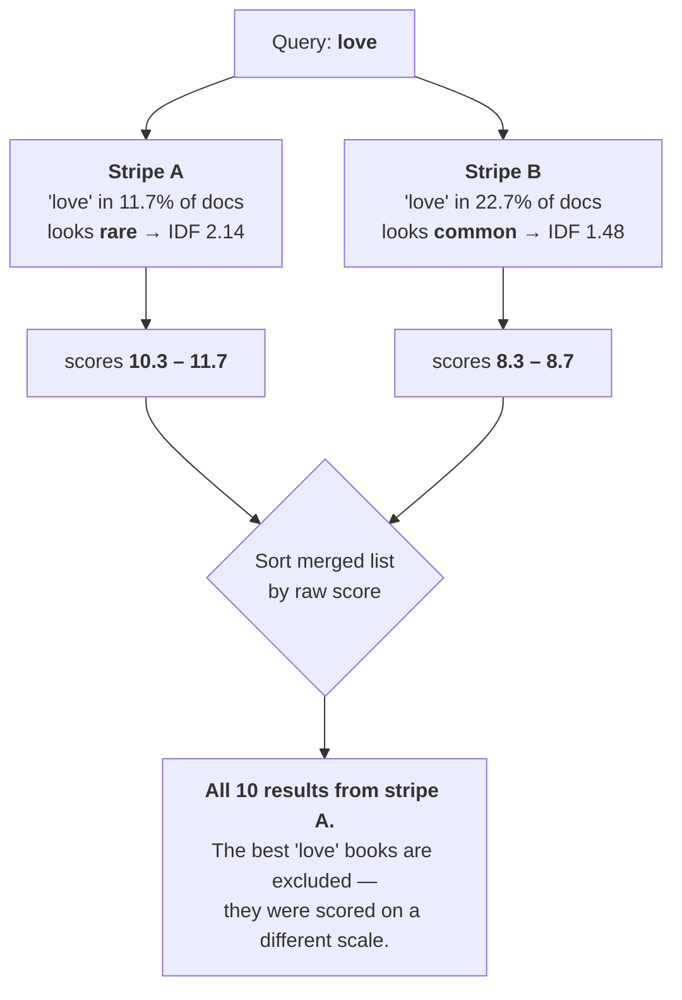
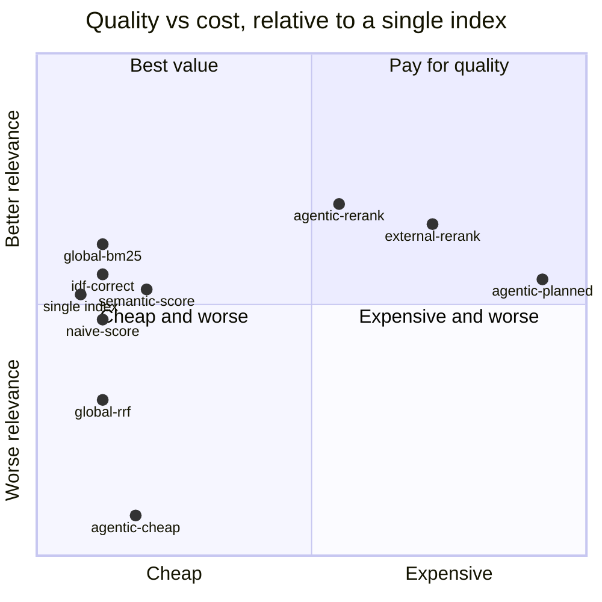
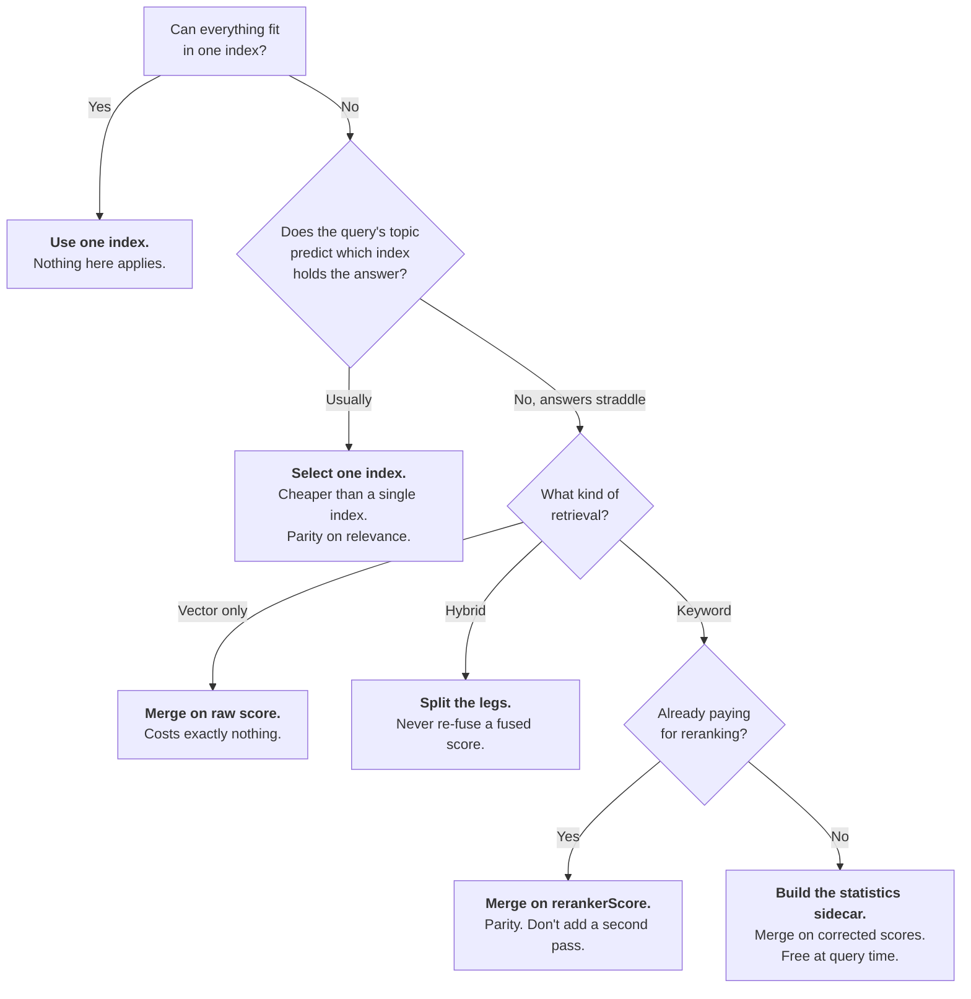

# What it costs to split one corpus across two search indexes

**Measured, with controls.** Splitting a 10,000-document corpus across two Azure AI Search indexes
and merging the results costs **between −0.119 and +0.096 nDCG@10 depending entirely on how you
merge** — and the best merge available at query-only cost lands within **+0.005 nDCG (95% CI
[−0.003, +0.013], p = 0.28)** of the same corpus in a single index. The relevance problem is real,
it is entirely in the merge step, and arithmetic fixes it.

| | |
| --- | --- |
| **Corpus** | 10,000 books, real titles and authors, model-written descriptions |
| **Queries** | 100, committed, 1–7 content terms |
| **Judgments** | 7,540 (query, document) pairs graded 0–3 by an independent model, then re-graded by a second |
| **Runs** | 3 retrieval modes × 2 tiers × up to 18 strategies |
| **Everything** | committed — per-query scores, judgments, seeds, commands |
| **Version** | 2026-09-06 · [`mrcarter8/cross-index-query`](https://github.com/mrcarter8/cross-index-query) |

---

## 1. Executive summary

Most people want one index. One index is simpler, cheaper, faster, and has no merge step to get
wrong. **That is the correct default and this report does not argue against it.**

Some workloads cannot have it. When they can't, three things are usually feared: relevance will
collapse, cost will double, latency will suffer. Measured, those fears are wrong in different
directions:

| Axis | What splitting actually costs |
| --- | --- |
| **Quality** | −0.015 nDCG with the obvious merge. **Parity or better** with a merge that costs nothing extra. Rank fusion, the conventional advice, loses **5×** more than the naive merge everyone worries about. |
| **Cost** | **≈1.4×** if you query both indexes — and **0.97×** if you can skip one. The driver is per-request overhead, not data volume: halving the index saves only 3.5% of a query. |
| **Latency** | **0.94×.** Splitting was *faster*, because the fan-out is concurrent and each index is half the size. |

The three largest caveats, stated here rather than buried:

1. **10,000 documents is not 2.4 TB.** The distortion measured here is scale-invariant in form but
   this corpus is small, uniform in document length, and English-only. See [§11](#11-threats-to-validity).
2. **The judge is a language model, not a human assessor.** Mitigated by a full second-judge
   re-grade ([§10.4](#104-two-judges)), not eliminated.
3. **One strategy is systematically under-credited.** `agentic-planned` retrieves more broadly than
   anything else in the study, so it surfaces documents no other system pooled. Its number is a
   lower bound. See [§8.4](#84-holes-in-the-judgments).

**Recommendation:** if you must split, merge on corrected scores. It costs one offline statistics
file and nothing at query time. Everything more expensive than that is buying a reranker — and a
reranker improves a single index by just as much, so it is never an argument *for* splitting.

---

## 2. Scope of the claim

Stated before the results, because a number without a scope is not a finding.

**This report claims**, for a corpus of ~10⁴ text documents of uniform length, split into two
indexes on a thematic axis, queried with 1–7 term natural-language queries, in English, on a
serverless Azure AI Search service:

- that merging on raw BM25 scores costs 0.015 nDCG@10 (95% CI [0.001, 0.029]);
- that merging on ranks costs 0.073 (95% CI [0.048, 0.099]);
- that merging on corrected scores costs nothing measurable and may gain slightly;
- that vector-only workloads lose exactly nothing;
- that querying both indexes costs about 1.4× a single index, driven by per-request overhead rather
  than data volume, and that the latency floor is below 1× because fan-out is concurrent;
- that selecting one index from committed statistics and querying only that one reaches statistical
  parity with a single index at 0.97× its cost — with a wide interval, and only on this query mix.

**This report does not claim** anything about: corpora at terabyte scale; heterogeneous document
lengths; non-English text; more than two indexes; splits across regions or services with real
network distance between them; paging or total-count correctness across a split; or freshness and
indexing cost. Several of these are discussed in [§12](#11-threats-to-validity) and
[§12](#12-what-we-did-not-measure) but none are measured.

---

## 3. Why anyone splits a corpus at all

Nobody splits for fun. The reasons cluster:

| Reason | Shape |
| --- | --- |
| **Size ceiling** | A single index is bounded by partition size × partitions — 12 partitions maximum on S1/S2/S3. At S3 that is roughly 2.4 TB. Past it, there is no bigger index to buy. |
| **Residency** | EU records must stay in the EU. That is a legal boundary, not a technical one, and it does not care about your ranking. |
| **Tenant isolation** | One index per customer, so a deletion request or a breach is bounded. |
| **Mergers** | Two systems, two indexes, and a consolidation project nobody has funded. |
| **Blast radius** | A rebuild that takes down half the corpus rather than all of it. |

Two of these produce very different splits, and the study measures both:

- **Intentional striping** — you know from day one you will exceed a limit, so you split on a
  meaningful axis: entity type, genre, region. Balanced sizes, *maximally divergent vocabulary*.
- **Splitting to scale** — you are already at the ceiling. You freeze the full index, point new
  writes at a second one, and let the old one drain. Wildly imbalanced sizes, *drifting vocabulary*.

The second is what a customer at the 2.4 TB ceiling actually does, because rebalancing 2.4 TB of
data is not a project anyone wants. It is measured in [§8.5](#85-splitting-to-scale).

---

## 4. What actually breaks

**Splitting the data does nothing to the data.** Each index ranks its own contents correctly. The
problem is entirely in combining two ranked lists, and it has one root cause:

> **A BM25 score is not a property of a document. It is a property of a document *relative to
> everything else in its index*.**

The term that carries this is inverse document frequency. With $N$ documents in the index and $n_t$
of them containing term $t$:

$$\text{IDF}(t) = \ln\left(1 + \frac{N - n_t + 0.5}{n_t + 0.5}\right)$$

Split the corpus and both $N$ and $n_t$ change. The same term is now scored on two different scales,
and sorting the merged list by raw score silently favours whichever index knows *least* about your
query.

### The `love` example, from the real corpus

| | Stripe A (fantasy, sci-fi, horror) | Stripe B (romance, literary fiction) |
| --- | ---: | ---: |
| Documents containing "love" | 11.7% | 22.7% |
| Resulting IDF | **2.142** | **1.484** |
| Score range returned | **10.3 – 11.7** | 8.3 – 8.7 |

Stripe A rarely sees the word, so it treats it as informative and scores its matches high. Stripe B
sees it constantly, judges it ordinary, and scores its matches lower — *including the ones that are
actually about love.*

Sort the merged list by raw score and you get **10 results from stripe A, 0 from stripe B.** The
single index's own top-10 for this query is 9/10 grade-3 documents and is essentially stripe B's
list. The naive merge scores **0.66** where the single index scores 0.94. Both repairs score
**1.00**.



### What does *not* break

- **Vector similarity.** Cosine similarity between a query vector and a document vector consults no
  corpus statistics whatsoever. A 0.83 means the same thing in every index. Measured: Kendall
  τ = **1.000**, not one rank inversion in 100 queries.
- **Semantic reranker scores.** A cross-encoder scores a (query, document) pair. Also
  corpus-independent, also directly comparable across indexes. This is why every reranked strategy
  reaches parity.

---

## 5. The four ways to merge

Ordered by what they cost at query time. Each is a runnable sample in [`samples/`](../samples/), and
the sample code is asserted by test to rank identically to the benchmarked implementation.

| # | Pattern | Who ranks | Extra cost |
| --- | --- | --- | --- |
| **1** | [**Query only**](../samples/Pattern1_QueryOnly.cs) | your code, arithmetic | none |
| **2** | [Self-rerank, external](../samples/Pattern2_ExternalRerank.cs) | a model you host | your model, per candidate |
| **3** | [Built-in semantic ranker](../samples/Pattern3_SemanticRanker.cs) | the service's cross-encoder | semantic meter, per index |
| **4** | [Agentic retrieval](../samples/Pattern4_AgenticRetrieval.cs) | the service, end to end | agentic meter |

Within pattern 1 there are five ways to combine two scored lists, and they are not equivalent:

| Merge | What it does | Verdict |
| --- | --- | --- |
| **Naive score** | sort by raw `@search.score` | the obvious wrong answer, and a *small* wrong answer |
| **Rank fusion (RRF)** | discard scores, combine ranks | **the conventional advice, and the worst option measured** |
| **Min-max / z-score** | normalise each list, then merge | worse than naive — normalises away real signal |
| **IDF correction** | rescale each index's scores by a global/local IDF ratio | free, and slightly better than not splitting |
| **Global BM25** | recompute the score client-side from corpus-wide statistics | best quality at query-only cost |

---

## 6. How this was measured

### 6.1 The arms

Three indexes: two stripes, plus a **single index holding all 10,000 documents**, built from exactly
the same documents with exactly the same schema and the same vectors. That identity is the basis of
every comparison — anything measured has to be attributable to the split and nothing else.

### 6.2 Held constant across every arm

Listed explicitly, because "we changed one thing" is a claim that has to be auditable:

- the same 100 queries, in the same order;
- the same corpus documents, byte-identical, with the same committed vectors;
- the same index schema, analyzer, semantic configuration and vector profile;
- the same embedding model and dimensionality (`text-embedding-3-small`, 1536);
- **the same candidate budget** — the single index retrieves 50, each stripe retrieves 25, so both
  arms put exactly 50 documents in front of the ranker. Without this the striped arm gets double the
  depth and every downstream number measures the split *and* the depth together;
- the same top-k cutoff (10) and the same metric implementation;
- warmup queries before every measured run, discarded, because serverless scales compute to zero
  after ~10 minutes idle and the first query pays a cold start that has nothing to do with strategy.

The one exception is documented rather than hidden: **agentic retrieval cannot be budget-equalized.**
The service rejects `maxOutputDocuments` below 50, so those rows see 2×50 against the single index's
1×50. Part of their advantage is candidate depth the other striped arms were denied.

### 6.3 Metrics

| Metric | Role | Why |
| --- | --- | --- |
| **judged nDCG@10** | **primary** | Absolute relevance from an independent judge. The only metric that can show a strategy *beating* the single index. |
| **Hole@10** | mandatory disclosure | Fraction of returned documents with no judgment. Unjudged counts as irrelevant, which penalises exactly the strategies that find things nothing else found. |
| nDCG / recall / RBO / Kendall τ vs single index | diagnostic | *Fidelity*, not quality. Measures how much the split changed the ranking, not whether the change was good. A strategy that reorders into something better scores low here. |
| Compute units, model tokens, ranker invocations | cost | Read from the service's own response headers and activity records, never estimated. |
| p50 / p95 latency | time | Wall clock, after warmup. |

Reporting fidelity *and* absolute relevance is deliberate. Fidelity alone cannot distinguish "the
merge broke the ranking" from "the merge improved the ranking", because both look like deviation.

### 6.4 Statistical protocol

- **Paired** on query id — the same 100 queries answered by every arm.
- **95% confidence interval** from a paired bootstrap, 10,000 resamples, fixed seed. This is the
  headline; per-query nDCG differences are a lumpy mixture with a spike at exactly zero, so a
  distribution-free interval is the honest choice.
- **Paired t-test**, reported for familiarity and as a cross-check on the bootstrap.
- **Wilcoxon signed-rank**, the conservative check — it discards magnitude, so one query with a huge
  swing cannot manufacture significance.
- **Holm step-down correction** across every strategy within a mode. At α = 0.05 with ten
  comparisons the uncorrected family-wise error rate is about 40%; correction is not optional.
- **Minimum detectable effect**: with n = 100 and the observed per-query difference variance, this
  design detects **≈ 0.014 nDCG** at 80% power. Effects smaller than that are below the resolution
  of the experiment and are reported as parity, not as small differences.

Every one of these is reproducible offline from the committed CSVs, with no Azure access:

```
cli compare --results results/results.genre.lexical.csv --candidate global-bm25
```

---

## 7. Results — the three axes

### 7.1 Query-only, no reranking anywhere

Genre split, keyword retrieval. Single index = 0.538.

| Strategy | Quality | Δ | 95% CI | p (Holm) | $/1K | Latency | Verdict |
| --- | ---: | ---: | :---: | ---: | ---: | ---: | --- |
| `global-bm25` | **0.634** | +0.096 | [+0.064, +0.128] | <0.0001 | $0.16 | 62 ms | best — but see [§10.1](#101-the-headline-that-did-not-survive) |
| *`single-index-rescored`* ⟵ control | *0.629* | *+0.092* | *[+0.058, +0.124]* | *<0.0001* | *$0.10* | *64 ms* | *the control that reframed the row above* |
| `selective-adaptive` | 0.625 | +0.089 | [+0.057, +0.121] | <0.0001 | $0.16 | 62 ms | skips an index when it can |
| *`local-bm25`* ⟵ control | *0.607* | *+0.069* | *[+0.036, +0.102]* | *0.0003* | *$0.16* | *61 ms* | *isolates statistics from tokenizer* |
| `idf-correct-probe` | 0.552 | +0.014 | [+0.005, +0.023] | 0.011 | $0.52 | 351 ms | same quality, 5.8× latency |
| `idf-correct-sidecar` | 0.550 | +0.013 | [+0.003, +0.022] | 0.017 | $0.16 | **60 ms** | **the recommendation** |
| *single index* | *0.538* | — | — | — | *$0.10* | *64 ms* | *baseline* |
| **`selective-one`** | **0.524** | **−0.013** | **[−0.038, +0.011]** | **0.33** *(parity)* | **$0.10** | 65 ms | **the only sub-1× cost option** |
| `naive-score` | 0.523 | −0.015 | [−0.029, −0.001] | 0.041 | $0.16 | 60 ms | the obvious wrong answer |
| `minmax-norm` | 0.473 | −0.064 | [−0.091, −0.039] | <0.0001 | $0.16 | 60 ms | |
| `zscore-norm` | 0.471 | −0.067 | [−0.092, −0.042] | <0.0001 | $0.16 | 60 ms | |
| **`global-rrf`** | **0.465** | **−0.073** | [−0.099, −0.048] | <0.0001 | $0.16 | 60 ms | **the conventional advice** |
| `interleave` | 0.457 | −0.081 | [−0.107, −0.055] | <0.0001 | $0.16 | 60 ms | |

**Three things to take from this table.**

**Rank fusion is the worst option measured, and it is what people are told to do.** RRF gets
recommended for cross-index merging precisely because it sidesteps incomparable scales — by throwing
the scores away. But a rank carries no information about how many documents it was drawn from: rank
1 of 19 ties rank 1 of 9,981. It loses **5× more than the naive merge** everyone worries about, and
it fails in vector mode too, where the scores were already perfectly comparable.

**The naive merge is smaller than its reputation.** −0.015, at the edge of what this design can
resolve (MDE 0.014), and one of the two judges scored it as indistinguishable from not splitting.
Fix it because the fix is free, not because it is an emergency.

**The fix costs nothing at query time.** `idf-correct-sidecar` reads a statistics file built once
offline. Same two queries, same compute, 60 ms against the single index's 64 ms. The `probe` variant
buys no additional quality for 5.8× the latency, which makes it a useful cautionary row: it is the
version people invent when they do not want to ship a sidecar.

### 7.2 With reranking

Single index + semantic ranker = 0.721. This tier is where the cost axis stops being an afterthought.

| Strategy | Quality | Δ | $/1K | vs single | p50 | vs single | Tokens/query |
| --- | ---: | ---: | ---: | ---: | ---: | ---: | ---: |
| **`agentic-rerank`** | **0.782** | **+0.061** | $9.40 | 8.5× | 1,864 ms | 11.7× | 18,500 |
| `external-rerank` | 0.769 | +0.048 | **$14.58** | 13.1× | **19,392 ms** | **122×** | 30,906 |
| `agentic-planned` | 0.726 | +0.005 | **$22.37** | **20×** | 3,916 ms | 25× | 43,427 |
| `semantic-score` | 0.722 | +0.001 | $2.22 | 2.0× | **155 ms** | **0.97×** | — |
| `semantic-rerank` | 0.722 | +0.001 | $4.38 | 3.9× | 274 ms | 1.7× | — |
| *single index + semantic* | *0.721* | — | *$1.11* | — | *159 ms* | — | — |
| `naive-score` | 0.602 | −0.119 | $2.22 | 2.0× | 158 ms | 0.99× | — |
| **`agentic-cheap`** | **0.456** | **−0.265** | $2.00 | 1.8× | 1,801 ms | 11.3× | **0** |

Cost assumes **$0.27 per compute-unit hour** and **$1.00 per 1K semantic ranker queries**, both read
from the Azure retail prices API for `centralus` on 2026-09-06, plus **$0.40 per million model
tokens**, which is an assumption rather than a measurement — substitute your own rate and the
token-bearing rows move with it. Token counts are measured from the service's activity records and
the model's own usage reports, not estimated.

**`semantic-score` is the answer at this tier.** Statistical parity with the single index
(Holm p = 1.000, 32 of 100 queries returning an identical list), at the same latency, for the price
of the second ranker invocation. If you already pay for reranking, splitting costs you nothing.

**`semantic-rerank` is `semantic-score` with a wasted second pass.** Identical quality to three
decimals — the same documents in the same order — at twice the cost and 1.7× the latency. If your
fan-out already asked for semantic ranking, sort by the score it returned and stop.

**`external-rerank` is Pareto-dominated.** `agentic-rerank` beats it on quality (+0.013), on cost
(35% cheaper) and on latency (**10× faster**). There is no workload here for which hosting your own
reranker is the better choice, unless no built-in ranker is available to you at all.

**`agentic-cheap` is the trap.** Agentic retrieval has a `resultsProcessing` switch. Set it to
`none` and reranking is skipped, model tokens drop to **zero**, and it looks like a free cross-index
merge engine. It is not free — it is the **worst result in the entire study**, −0.265, below every
hand-written merge. With no comparable score to sort by, the service falls back to distributing
results round-robin across sources. Which is interleaving. Which this report already measured as the
worst merge available.

### 7.3 Hybrid and vector

| Mode | Strategy | Quality | Δ | p |
| --- | --- | ---: | ---: | ---: |
| **Hybrid** | `hybrid-legs` | 0.687 | +0.007 | 0.38 *(parity)* |
| | *single index* | *0.680* | — | — |
| | `naive-score` | 0.619 | −0.062 | <0.0001 |
| | `global-rrf` | 0.585 | −0.095 | <0.0001 |
| | `idf-correct-sidecar` | 0.555 | **−0.125** | <0.0001 |
| **Vector** | *single index* | *0.687* | — | — |
| | `naive-score` | 0.683 | −0.004 | 0.18 *(parity)* |
| | `global-rrf` | 0.593 | −0.094 | <0.0001 |

**A hybrid score is already fused and cannot be re-fused.** `@search.score` on a hybrid query is an
RRF output. Merging two of them combines two fusions, and applying an IDF correction to one is
*worse than doing nothing* (−0.125) because there is no BM25 left inside it to correct. Ask for the
subscores — they come back free on the same response — and merge the legs separately.

**Vector splitting is exactly free.** Kendall τ = 1.000. The apparent 0.974 fidelity is *not* a
splitting cost: τ says nothing was reordered, and the shortfall is documents that never became
candidates, because HNSW is approximate and two smaller proximity graphs are not traversed like one
large one. Under exhaustive search the striped arm reproduces the single index perfectly:

| Vector search | Fidelity | Recall@10 | Kendall τ | Judged |
| --- | ---: | ---: | ---: | ---: |
| HNSW *(the default)* | 0.974 | 0.960 | 1.000 | 0.683 |
| Exhaustive | **1.000** | **1.000** | **1.000** | **0.684** |

---

## 8. Reading the tradeoff

### 8.1 The order-of-magnitude picture

Everything relative to a single index. This is the table to remember.

| What you do | Quality | Cost | Latency |
| --- | ---: | ---: | ---: |
| **Single index** | 1.00× | 1.00× | 1.00× |
| **Split + select one index** | **0.98×** | **0.97×** | **1.00×** |
| Split + corrected scores | **1.02×** | 1.4× | **0.94×** |
| Split + naive scores | 0.97× | 1.4× | 0.94× |
| Split + rank fusion | 0.86× | 1.4× | 0.94× |
| Split + built-in reranker | **1.00×** | 2.0× | **0.96×** |
| Split + agentic retrieval | 1.08× | 8.5× | 11.7× |
| Split + LLM query planning | 1.01× | 20× | 25× |
| Split + self-hosted reranker | 1.07× | 13.1× | **122×** |

Three separate stories, and they do not point the same way:

- **Quality spans 0.86× to 1.08×** — a ±14% band, and the negative half is entirely avoidable by
  choosing a different merge.
- **Cost is about 1.4× if you query both indexes**, and there is exactly one way below it: don't
  query both. Everything above 2× is buying a model, not fixing the split.
- **Latency is free — until it isn't.** Splitting alone is *faster*. Adding a model costs one to two
  orders of magnitude.

### 8.2 What actually drives the dollar cost

A natural assumption is that the cost premium comes from the semantic ranker. It does not — the
query-only tier has the ranker switched off entirely and still costs 1.4×. The premium is compute
units, and the interesting part is what compute units respond to.

Three measurements, each holding the other variables fixed:

| Change | Effect on cost |
| --- | ---: |
| Halve the **index size**, same 50 results | **3.5% cheaper** |
| Halve the **results requested**, same index | **29% cheaper** |
| Split one query into **two queries** | **+37%** |

**Index size barely matters. Per-request overhead dominates.** Fitting the measured points gives a
fixed cost of roughly **40% of a query**, paid once per index touched, plus a variable part that
tracks how many results you ask for:

$$\text{CU} \approx \underbrace{0.00017 \times k}_{\text{per index touched}} + \underbrace{0.0000054 \times r}_{\text{per result returned}}$$

for $k$ indexes returning $r$ results between them. That predicts:

| Stripes | Predicted | Measured |
| --- | ---: | ---: |
| 1 | 0.97× | **0.97×** ✓ |
| 2 | 1.37× | **1.36×** ✓ |
| 3 | 1.77× | *not measured* |
| 4 | 2.17× | *not measured* |

**Each additional index adds about 0.4×, whether or not that index contributes anything to the
answer.** For anyone weighing two stripes against three, that is the number to plan against: not
"50% more per stripe", but a flat toll per index on every query issued.

It also explains why every query-only merge in this study costs *exactly the same*. The merge
arithmetic — rescaling, recomputing BM25, fusing ranks — runs on your own CPU in microseconds and
costs nothing. `naive-score`, `global-rrf` and `global-bm25` are all $0.16 per 1,000 queries because
**you are paying for the round trips, not for what you do with the results.** Which is exactly why
doing the merge *well* is free: the expensive part already happened.

> **A note on precision.** Serverless compute metering varies between runs. The single-index
> baseline measured 0.000384 CU in one run and 0.000430 in another — about 12% apart — while the
> two-stripe figure stayed within 1%. The multiple is therefore quoted as ≈1.4× rather than to three
> digits, and the decomposition above uses points measured within a single run.

### 8.3 Where the options actually sit



The upper-left region is what you want. `idf-correct` and `global-bm25` sit there at query-only
cost. `agentic-rerank` buys real quality but at 8.5× the price and 11.7× the latency.
`agentic-planned` and `external-rerank` are dominated — something cheaper is also better.

### 8.4 Holes in the judgments

Unjudged documents count as irrelevant, the standard pooling convention, which biases *against*
whichever strategy surfaces documents no other approach found. Reported per arm, because this study
was bitten by it three separate times:

| Strategy | Hole@10 | Effect when closed |
| --- | ---: | --- |
| Most strategies | 0.4 – 1.2% | negligible |
| `global-bm25` | was 19% | scored +0.040 → **+0.096** when the pool reached 99% |
| `local-bm25` | was 6% | 0.594 → 0.607 |
| `agentic-rerank` | was 13% | 0.715 → **0.783** |
| **`agentic-planned`** | **13%** | **still open — its 0.726 is a lower bound** |

`agentic-planned` decomposes one query into several subqueries and runs each against both stripes,
so by construction it retrieves more broadly than anything else here. Every round of judging closes
part of the hole and its score rises. **Its number should be read as a floor, not an estimate**, and
it is the one row in this report a reader should distrust in the direction of being too low.

No comparison in this report is drawn between arms at materially different Hole@10.

### 8.5 Splitting to scale

Temporal split, modelling the real migration: freeze the full index, send new documents to a new
one. Single index baseline 0.542–0.547 at every ratio.

| Imbalance | `idf-correct` | `naive-score` | `quota-merge` | **`global-rrf`** |
| --- | ---: | ---: | ---: | ---: |
| **525:1** *(day one)* | 0.546 | 0.546 | 0.468 | **0.381** |
| **45:1** | 0.546 | 0.545 | 0.484 | **0.353** |
| **9.4:1** | 0.541 | 0.537 | 0.521 | **0.437** |
| **2.8:1** | 0.535 | 0.535 | 0.512 | **0.487** |
| **1.0:1** *(balanced)* | 0.540 | 0.532 | 0.516 | **0.516** |

**Score merging is safe at every ratio** — within 0.001–0.010 of a single index throughout. **Rank
fusion collapses**, and collapses *worst* when the imbalance is most extreme, which is exactly the
day-one state of a scale split. A tiny index's rank 1 is not a big index's rank 1, and RRF cannot
tell the difference.

The damage model that explains the whole table:

$$\text{damage} \approx \text{score incomparability} \times \text{how often the small index contributes}$$

The 525:1 split has the **highest** vocabulary divergence in the study (mean |ΔIDF| = 1.360) and the
**least** damage (+0.004), because the tiny stripe contributes 0.0% of results. Divergence only hurts
when both indexes actually reach the merged list.

---

## 9. The options, one at a time

Every technique measured, in a consistent format: how it works, what it costs on all three axes,
and when it is the right choice. Ordered by cost.

Multiples are relative to a single index holding the whole corpus. Quality is judged nDCG@10.

---

### Pattern 1 — query only

Your code merges the results. No model anywhere. Every option in this group costs the same in
dollars, because the arithmetic runs on your CPU and only the round trips are billed.

---

#### `selective-one` — query one index, not both

**How it works.** Before querying anything, score each index by how much of the answer it is likely
to hold, using per-index term statistics from a file built once offline. Query only the winner. For
a query about romance, an index of horror novels contributes nothing, and the statistics say so
without needing a request to find out.

| Quality | Cost | Latency |
| ---: | ---: | ---: |
| **0.98×** *(0.524 vs 0.538, p = 0.33 — parity)* | **0.97×** | **1.00×** |

**The only option that costs less than a single index**, because it is the only one that declines to
issue the second query. Statistically indistinguishable from not splitting at all: 48 queries better,
47 worse, 5 tied.

**Use it when** your split is *topical* and your queries are too — one index per product line, per
language, per tenant. The more a query's subject matter predicts which index holds the answer, the
better this works.

**Avoid it when** relevant documents genuinely straddle the split. Skip an index that held the
answer and the answer is gone; no downstream merge can recover it. The wide interval here
(±0.025 against a 0.014 detection floor) reflects exactly that: it is right most of the time and
badly wrong occasionally, where every other option is consistently a little wrong.

---

#### `naive-score` — sort the merged list by `@search.score`

**How it works.** Concatenate both result sets, sort descending by the score the service returned,
take the top 10. It is what almost everyone writes first.

| Quality | Cost | Latency |
| ---: | ---: | ---: |
| 0.97× *(−0.015, p = 0.041)* | 1.4× | 0.94× |

**Wrong, but less wrong than its reputation.** BM25 scores from two indexes are computed against
different corpora and are not comparable — yet the measured damage is 0.015 nDCG, at the edge of
what this design can resolve, and one of the two judges scored it as indistinguishable from not
splitting.

**Use it when** you are prototyping and know you will replace it, or when your retrieval is
vector-only (where it is not merely acceptable but exactly correct).

**Avoid it when** a free alternative exists — which, for keyword search, it always does. Fix this
because the fix costs nothing, not because it is an emergency.

---

#### `global-rrf` and `interleave` — merge on ranks

**How it works.** Discard the scores entirely. Combine by rank position instead —
$\sum_i 1/(k + \text{rank}_i)$ for RRF, or strict round-robin for interleaving. The appeal is
obvious: if the scores are incomparable, stop using them.

| Quality | Cost | Latency |
| ---: | ---: | ---: |
| **0.86×** *(−0.073 and −0.081, p < 0.0001)* | 1.4× | 0.94× |

**The worst options measured, and the conventional advice.** Rank fusion is recommended precisely
because it sidesteps incomparable scales, but a rank carries no information about the pool it came
from: rank 1 of 19 ties rank 1 of 9,981. It loses **five times more than the naive merge** it was
meant to improve on, and it fails in vector mode too, where the scores were already perfectly
comparable.

**Use it when** you are fusing genuinely different *retrieval systems* on the same corpus — which is
what RRF was designed for and where it earns its reputation.

**Avoid it when** merging the same ranking function across a partitioned corpus. That is this
problem, and it is the wrong tool for it.

---

#### `minmax-norm` and `zscore-norm` — normalise, then merge

**How it works.** Rescale each index's scores to a common range — min-max to [0,1], or z-score to
zero mean and unit variance — then sort the combined list.

| Quality | Cost | Latency |
| ---: | ---: | ---: |
| 0.88× *(−0.064 and −0.067, p < 0.0001)* | 1.4× | 0.94× |

**Worse than doing nothing.** Normalisation forces both result sets to occupy the same range, which
destroys the real signal that one index genuinely had better matches than the other. An index with
nothing relevant gets its best non-answer promoted to 1.0 alongside the other index's actual answer.

**Use it when** — on this evidence, don't. It is included because it is a common intuition and
because measuring it is cheaper than arguing about it.

---

#### `idf-correct-sidecar` — rescale scores using global statistics

**How it works.** Build one file offline containing each term's corpus-wide document frequency. At
query time, for each returned document, compute the ratio between what its index thought the query
terms were worth and what the whole corpus says they are worth, and rescale the score by it. Pure
arithmetic on numbers you already have.

| Quality | Cost | Latency |
| ---: | ---: | ---: |
| **1.02×** *(+0.013, p = 0.017)* | 1.4× | **0.94×** |

**The recommendation for most people.** It repairs the actual defect — incomparable IDF — without
touching anything else, and it is the only strategy here that both fixes the problem and leaves the
service's own ranking otherwise intact (fidelity 0.965, the highest of any repair).

**Use it when** you are splitting a keyword or hybrid corpus and want the problem to go away. One
offline pass, no query-time cost, no model, no tier change.

**Avoid it when** your scores are not BM25. Applying it to a hybrid score makes things **worse**
(−0.125) because there is no BM25 left inside an already-fused score to correct.

---

#### `idf-correct-probe` — the same fix without the sidecar

**How it works.** Identical correction, but instead of reading document frequencies from a file, it
discovers them at query time by issuing a probe query per term per index.

| Quality | Cost | Latency |
| ---: | ---: | ---: |
| 1.03× *(+0.014, p = 0.011)* | **3.3×** | **5.8×** |

**A cautionary row.** Same quality as the sidecar to within noise, for 8.5 queries instead of 2 and
351 ms instead of 60. It is what people build when they do not want to ship an extra artifact, and
it demonstrates what that convenience costs.

**Use it when** your corpus changes so fast that a periodically-rebuilt statistics file would be
stale — and even then, measure whether staleness actually hurts before paying 5.8× latency for
freshness.

---

#### `global-bm25` — recompute the score yourself

**How it works.** Ignore the returned scores completely. Using the document text that came back and
corpus-wide statistics from the sidecar, recompute BM25 from scratch for every candidate. Every
quantity now comes from the whole corpus, so the result cannot depend on which index produced the
document.

| Quality | Cost | Latency |
| ---: | ---: | ---: |
| **1.18×** *(+0.096, p < 0.0001 — but see below)* | 1.4× | 0.94× |

**The highest-scoring query-only option, and the one that needed a control.** Most of that +0.096 is
*not* about splitting: it also replaces the service's scoring with your own, which helps a single
index just as much. The same rescorer applied to an unsplit corpus scores +0.092 by itself. The
split-attributable part is **+0.005, p = 0.28** — nothing. See
[§10.1](#101-the-headline-that-did-not-survive).

**Use it when** you can return the document text and want the split to become undetectable. That it
also appears to improve absolute relevance is a separate, unproven effect that this study does not
recommend relying on.

**Avoid it when** you cannot afford to return full text on every result, or your ranking depends on
scoring profiles and field weights that a client-side recomputation will not reproduce.

---

#### `selective-adaptive` — skip an index when confident, query both when not

**How it works.** Score both indexes as `selective-one` does, but query the second one too whenever
its expected yield is within 65% of the best. When both are queried, merge with `global-bm25`.

| Quality | Cost | Latency |
| ---: | ---: | ---: |
| **1.16×** *(+0.089, p < 0.0001)* | 1.34× | 0.94× |

**A dial, not a setting.** On this query mix it skipped an index only 9% of the time, so it behaves
mostly like `global-bm25` at slightly lower cost. Tighten the threshold and it approaches
`selective-one`'s 0.97×; loosen it and it becomes an ordinary fan-out.

**Use it when** your query mix is genuinely mixed — some queries obviously topical, others
cross-cutting — and you want per-query cost to follow that rather than paying the worst case every
time.

---

### Pattern 2 — self-rerank, external

---

#### `external-rerank` — score every candidate with your own model

**How it works.** Fan out to both indexes, pool the candidates, then call a chat model once per
document asking it to grade relevance to the query. Sort by the grades. The scores never need to be
comparable because they are all discarded.

| Quality | Cost | Latency |
| ---: | ---: | ---: |
| 1.07× *(+0.048, p = 0.0009)* | **13.1×** | **122×** |

**Pareto-dominated here.** It works — a cross-encoder-style judgment is genuinely corpus-independent
— but agentic retrieval reaches higher quality at 35% less cost and **10× lower latency**. 30,906
tokens and 19 seconds per query is a heavy price for a result something cheaper beats.

**Use it when** no built-in reranker is available to you: a different search engine, an air-gapped
deployment, or a domain where you have a fine-tuned relevance model that a general one cannot match.

**Avoid it when** the platform offers reranking natively. This measurement says the built-in path
wins on all three axes at once.

---

### Pattern 3 — the built-in semantic ranker

---

#### `semantic-score` — merge on `@search.rerankerScore`

**How it works.** Ask each index for semantic ranking on its own results, then merge the two lists
by the reranker score. That score comes from a cross-encoder over the (query, document) pair and
consults no corpus statistics, so a 2.4 from one index means exactly what a 2.4 from the other does.
The comparability problem simply does not arise.

| Quality | Cost | Latency |
| ---: | ---: | ---: |
| **1.00×** *(+0.001, Holm p = 1.000 — parity)* | 2.0× | **0.96×** |

**The cleanest answer at this tier.** Statistical parity with a single index, 32 of 100 queries
returning a byte-identical list, at the same latency. The extra cost is one additional semantic
ranker invocation, because the meter charges per query and you now issue two.

**Use it when** you already pay for semantic ranking. Splitting then costs you nothing measurable in
relevance, and the merge is four lines of code.

**Avoid it when** you are not otherwise using the ranker — turning it on purely to solve a merge
problem costs 2× where arithmetic costs 1.4×.

---

#### `semantic-rerank` — a second reranking pass over the merged pool

**How it works.** Merge the two result sets, then send the combined pool back for a second semantic
ranking pass, on the theory that ranking everything together must beat ranking each half separately.

| Quality | Cost | Latency |
| ---: | ---: | ---: |
| **1.00×** *(identical to `semantic-score` to three decimals)* | 4.0× | 1.7× |

**It buys nothing.** Same documents, same order, zero wins and zero losses against `semantic-score`
across all 100 queries — for twice the cost and 1.7× the latency. The reason is structural: the
score was already comparable, so re-deriving it changes nothing.

**Use it when** — never, on this evidence. It is included because it is the natural thing to try, and
"we measured it and it is exactly identical" is more useful than an argument.

---

### Pattern 4 — agentic retrieval

The service retrieves from every index and returns one ranked list. There is no client-side merge at
all.

---

#### `agentic-rerank` — let the service retrieve and rank

**How it works.** Query a knowledge base that references both indexes. The service fans out, ranks
everything with the semantic ranker, and returns merged references with scores and source
attribution.

| Quality | Cost | Latency |
| ---: | ---: | ---: |
| **1.08×** *(+0.061, p < 0.0001)* | 8.5× | 11.7× |

**The highest-quality option measured.** Note it cannot be budget-equalized with the rest of the
table — the service floors candidate depth at 50 per source, so it sees 2×50 against the single
index's 1×50, and some of its advantage is that extra depth rather than better ranking.

**Use it when** you want the platform to own collation and can absorb ~2 seconds per query. It is
also the least code of any option here.

**Avoid it when** latency matters. Twelve times slower than merging client-side, for +0.06 nDCG.

---

#### `agentic-planned` — let an LLM rewrite the query first

**How it works.** Attach a model to the knowledge base and raise the reasoning effort. The model
decomposes one query into several subqueries and runs each against every index — "books about love
and loss" became three subqueries across two stripes, so six searches for one user query.

| Quality | Cost | Latency |
| ---: | ---: | ---: |
| 1.01× *(+0.005 — and a lower bound, see [§8.4](#84-holes-in-the-judgments))* | **20×** | 25× |

**The most expensive option, and the least conclusive.** Its 13% judgment hole means its true score
is higher than printed — by construction it retrieves more broadly than anything else and surfaces
documents nothing else pooled. **This row should be read as unresolved rather than as a negative
result.**

**Use it when** your queries are short and underspecified — a bare company name, a product code —
where the ranking has to come from the corpus because the query carries almost no signal. That is
the case query planning is designed for, and this corpus's 1–7 term natural-language queries are not
it.

**Avoid it when** your queries already carry enough context to retrieve on. You are paying 20× to
rewrite a query that did not need rewriting.

---

#### `agentic-cheap` — agentic retrieval with reranking switched off

**How it works.** Set `resultsProcessing: "none"`. The service still retrieves from every index, but
skips the semantic ranker entirely. Model tokens drop to zero.

| Quality | Cost | Latency |
| ---: | ---: | ---: |
| **0.63×** *(−0.265, p < 0.0001)* | 1.8× | 11.3× |

**The trap in this report.** It looks like a free cross-index merge engine: the platform does the
fan-out, you write no merge code, and it costs no model tokens. It is the **worst result in the
entire study** — worse than every hand-written merge, worse than rank fusion. With no comparable
score to sort by, the service falls back to distributing results round-robin across sources. Which is
interleaving. Which this report already measured as the worst merge available.

**Use it when** — never, for ranked retrieval. If you want a cheap merge, the arithmetic in pattern 1
is cheaper *and* two-thirds better.

---

## 10. Experiments that could have falsified this

Every claim above is paired with an experiment designed to break it. Two succeeded.

### 10.1 The headline that did not survive

An earlier version of this report claimed `global-bm25` made a **split corpus beat a single index**
by +0.096 nDCG. That claim was confounded and is **withdrawn**.

`global-bm25` changes two things at once: it repairs the cross-index statistics *and* it replaces the
service's scoring with a client-side BM25 over text the caller already has. Only the first is about
splitting. Two controls separate them:

- **`local-bm25`** — identical tokenizer, constants, fields and arithmetic; only the statistics
  source differs. Isolates "global statistics" from "client-side rescoring".
- **`single-index-rescored`** — the *same* `global-bm25` instance applied to the single index. A
  single index holding the whole corpus *is* the corpus, so this is the striped strategy with the
  split removed and nothing else changed.

| Step | Judged nDCG@10 | Δ | p |
| --- | ---: | ---: | ---: |
| Single index, service BM25 | 0.538 | — | — |
| Single index, **client-side rescore** | 0.629 | **+0.092** | <0.0001 |
| Two stripes, **same rescore** | 0.634 | **+0.005** | 0.28 *(n.s.)* |

**95% of the effect was the rescorer, not the split.** 59 of 100 queries returned an identical
top-10. The replacement claim is narrower and more useful: *splitting costs nothing when you merge on
recomputed scores.*

The general failure is worth naming because it is easy to repeat. A strategy that differs from its
baseline in two ways produces one number, and that number will be read as evidence for whichever
mechanism the author had in mind. The defence is not care; it is a control that varies one thing and
is capable of coming out against you.

### 10.2 A refuted prediction, kept

We predicted that IDF deflation in the small index of a scale split would bury new documents.
Measured: **−0.005, t = −0.83, not significant.** Deflation is near-uniform across terms, and ranking
is invariant to a uniform rescale. The prediction was wrong and is recorded as wrong.

### 10.3 The A/A control

A **random** split produces stripes with statistically identical term distributions — nothing to
correct, so every strategy should converge. It does. Mean |ΔIDF| by document-frequency band decays
0.23 → 0.03 under a random split, the signature of sampling noise, but **plateaus** at 0.82 → 0.41
under a genre split, the signature of real divergence. This is what confirms the effect is the split
and not the harness.

### 10.4 Two judges

All pairs were re-graded by a second, different model. Quadratically-weighted κ = 0.735, 99.3%
agreement on grade 3, and a +0.532 mean shift in generosity.

**26 of 27 conclusions were identical under both judges.** The exception: keyword `naive-score` moved
from "significantly worse" to "parity", which is why this report states it as directional rather than
established.

What judge agreement *cannot* do: both judges agreed `global-bm25` scored far above the single index,
and both were right — neither could reveal that the gain was mostly a change of scorer. Agreement
tests whether a measurement is stable, not whether it answers the question being asked. That needs a
control.

### 10.5 Exhaustive nearest-neighbour

Vector mode showed τ = 1.000 alongside 0.974 nDCG, which cannot both be statements about ranking.
Re-running with exact search resolved it: 1.000 fidelity, 1.000 recall. The gap was HNSW
approximation, not splitting.

---

## 11. Threats to validity

**Construct.** The judge is a language model grading text written by a model from the same family.
Mitigated by the second-judge re-grade (§10.4) but not eliminated — a bias shared across that family
would be invisible to the check.

**Internal.** Pooling bias is the dominant threat and it is not fully closed: `agentic-planned`
remains at 12.1% Hole@10 (§8.4). Candidate budget is equalized everywhere except agentic retrieval,
where the service's floor of 50 makes it impossible (§6.2).

**External.** 10,000 documents, not 2.4 TB. The core distortion is scale-invariant in form — IDF
divergence depends on the *ratio* of term densities, so

$$\text{IDF}_A - \text{IDF}_B \approx \ln\!\left(\frac{n_B/N_B}{n_A/N_A}\right)$$

is unchanged by scaling both stripes up. But three things do change with size: sampling noise falls
(strengthening these conclusions), vocabulary grows as roughly √N (widening the problem, since rare
terms are where divergence lives), and the candidate window becomes a far smaller fraction of the
corpus (untested).

**The corpus understates the problem.** Descriptions are uniform — ~120 words, average length 91.6
tokens, tight variance. Average document length diverged between stripes by only 0.2–2.3%, so BM25's
length-normalisation term is effectively constant here and did not need correcting. A real corpus
split by entity type, where a contact record is 40 tokens and an attachment is 4,000, would see that
term diverge substantially. **Real-world damage is likely worse than measured, and the correction
shown here handles only the IDF half.**

**Some documents cannot be judged at all.** Azure OpenAI's content filter rejected a minority of
pairs as `ResponsibleAIPolicyViolation`, predominantly `hate` at medium severity — the corpus is real
published books, and books about war and atrocity trip a classifier tuned for generated content.
Those pairs stay `null`, meaning "not judged", rather than 0, which would assert "not relevant" and
penalise whichever strategy surfaced them.

**Conclusion validity.** Effects below 0.014 nDCG are below this design's minimum detectable effect
and are reported as parity. Holm correction is applied within each mode; comparisons *across* modes
are not corrected and should be read as exploratory.

---

## 12. What we did not measure

1. **Paging and total counts across a split.** Deep paging over a merged result set requires
   over-fetching from every index; `@odata.count` is per-index and does not sum correctly once
   deduplication is involved. This report solves neither.
2. **More than two indexes.** Everything here is 2-way.
3. **Cross-region or cross-service splits.** Same service, same region. Real network distance would
   change the latency findings, which currently show fan-out as *free*.
4. **Indexing and freshness cost.** Query-side only.
5. **Filtered and faceted queries.** Facet counts across a split have the same comparability problem
   as scores, and are untested.
6. **Scoring profiles and boosting.** Agentic retrieval does not accept them at all.
7. **LLM query planning at `medium` reasoning effort.** Only `low` was measured.
8. **Tail latency under concurrency.** All measurements are sequential, single-client.

---

## 13. Recommendation



### The rules, in priority order

1. **Never merge on ranks.** RRF is the worst option measured, in every mode — including vector,
   where there was nothing for it to fix.
2. **Consider not querying every index.** It is the only move that lands below single-index cost,
   and on a topical split it reached parity. It is a gamble on each query, so measure it on your own
   query mix before trusting it.
3. **Merge on scores, corrected.** One offline pass, nothing at query time.
4. **Decompose hybrid queries into their legs.** A hybrid score is already fused. The subscores come
   back free on the same response.
5. **Apply the right repair to the right signal.** IDF correction on a hybrid score makes things
   *worse* (−0.125).
6. **If you already pay for the semantic ranker, merge on `rerankerScore` and stop.** A second
   reranking pass is measurably identical and twice the price.
7. **If your workload is vector-only, do nothing.** Splitting is free.
8. **Do not use agentic retrieval's free mode as a merge engine.** Zero tokens, worst relevance in
   the study.

### Choosing a pattern

| Your situation | Use | Expect |
| --- | --- | --- |
| Topical split, topical queries | **`selective-one`** | parity, **0.97× cost**, 1.00× latency |
| Keyword, cost-sensitive | **Pattern 1**, sidecar or client-side BM25 | parity to +0.013, 1.4× cost, 0.94× latency |
| Mixed query population | **`selective-adaptive`** | +0.089, 1.34× cost, 0.94× latency |
| Vector only | **Pattern 1**, naive merge is correct | exact parity, free |
| Hybrid | **Pattern 1**, merge the legs | parity |
| Already paying for semantic ranking | **Pattern 3**, merge on `rerankerScore` | parity, 2× cost, same latency |
| Want the service to own collation | **Pattern 4**, `resultsProcessing: rerank` | +0.061, 8.5× cost, 11.7× latency |
| No built-in reranker available | **Pattern 2** | +0.048, 13.1× cost, **122× latency** |
| Tempted by agentic retrieval's free mode | **don't** | −0.265, worst measured |

---

## 14. Reproducing this

Everything needed is committed. Nothing below requires a subscription except the live runs.

| Artifact | Location |
| --- | --- |
| Per-query scores, every arm | [`results/*.csv`](../results/) |
| Relevance judgments, both judges | [`data/judgments.json`](../data/), `judgments.second-judge.json` |
| Judgment pools | [`results/judgment-pool.*.json`](../results/) |
| Query set | [`data/queries.json`](../data/) |
| Corpus statistics per split | [`data/corpus-statistics.*.json`](../data/) |
| Merge implementations | [`src/CrossIndexQuery.Core/Fusion/`](../src/CrossIndexQuery.Core/Fusion/) |
| Pasteable samples | [`samples/`](../samples/) |
| Decision log, including refuted predictions | [`docs/decisions.md`](decisions.md) |

```powershell
# Re-run any significance test offline. No Azure access, no cost.
dotnet run --project src/CrossIndexQuery.Cli -- compare `
  --results results/results.genre.lexical.csv --candidate global-bm25

# The comparison that isolates splitting from rescoring
dotnet run --project src/CrossIndexQuery.Cli -- compare `
  --results results/results.genre.lexical.csv `
  --baseline single-index-rescored --candidate global-bm25

# Reproduce the full matrix (requires a service)
dotnet run --project src/CrossIndexQuery.Cli -- evaluate --modes Keyword --modes Hybrid --modes Vector
```

The bootstrap seed is fixed (`20260904`) so intervals reproduce exactly. Sample code is asserted by
test to rank identically to the benchmarked implementations, so the pattern you paste is the code
that produced these numbers.

---

*This study measures relevance, cost and latency. It does not solve paging or result counts, and §11
says so plainly. Where a claim was withdrawn, the withdrawal is documented rather than edited out.*
