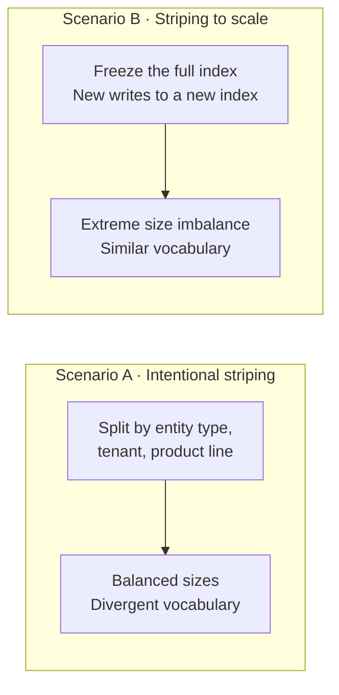
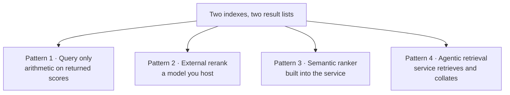

# What striping actually costs you

**A measured study of cross-index relevance in Azure AI Search**

---

## The objection

> "If I split my corpus across two indexes, my relevance is going to get worse. There's no way
> around it."

This is the most common reaction to striping. The first thing to say is that **the instinct is
sound**: merging results from two indexes carelessly does cost relevance, and we measured how much.

The second thing is that the cost is **not where people expect it**. Sorting the merged list by raw
`@search.score` — the obvious mistake — turns out to be a small effect, small enough that it moves
between "worse" and "parity" depending on which model judges the results. The large, unambiguous,
reproducible loss comes from the technique most commonly *recommended* for merging across indexes:
rank fusion.

And the whole loss is recoverable at **no query-time cost**. Not by reranking, not by adding a model,
not by moving to a higher tier. By arithmetic over a file you build once.

This report shows the measurements behind all three claims.

---

## Summary

Measured over 10,000 documents, 100 queries, and 7,016 relevance judgments graded by an independent
model — then **re-graded entirely by a second model**, with every conclusion recomputed. 26 of 27
conclusions were identical under both judges.

| | keyword nDCG vs single index | verdict |
| --- | ---: | --- |
| Merge on **ranks** (RRF, interleave) | **−0.061 to −0.081** *(p<0.0001)* | the worst thing you can do |
| Merge on **raw scores** | −0.015 to −0.002 | small, and judge-dependent |
| Merge on **corrected scores** | **+0.013 to +0.016** *(p<0.005)* | free, and better than not striping |
| **Recompute BM25** client-side | **+0.005** *(p=0.28)* vs the same rescorer unstriped | **striping is free** |
| **Rerank** on either side | **parity to +0.060** *(Holm p=1.000 to <0.0001)* | striping costs nothing |
| **Vector-only** workloads | **exactly identical** *(τ=1.000, and 1.000 fidelity under exact search)* | striping is provably free |

Ranges show the two independent judges. Findings worth carrying away:

1. **The cost of striping is entirely in the merge step**, and it is recoverable with arithmetic over
   a file you build once. No model, no extra queries, no tier upgrade.
2. **Reciprocal Rank Fusion — the conventional recommendation for merging across indexes — is the
   worst option measured**, in every retrieval mode, by a margin four to five times larger than the
   naive merge everyone worries about. It is the finding most likely to change what you do on Monday.
3. **Naive score merging is a smaller problem than its reputation.** It is directionally worse, but
   at the boundary of what this study can resolve. Worth fixing because the fix is free, not because
   it is an emergency.
4. **Reranking is worth ~0.19 nDCG**, an order of magnitude more than anything striping does to you
   in either direction. If relevance is your problem, that is where the leverage is.
5. **Vector search has no cross-index problem at all.** Cosine similarity consults no corpus
   statistics, so merged results reproduce the single-index ranking exactly.

> **A correction, kept in place deliberately.** An earlier version of this report claimed the
> client-side BM25 recomputation made a striped corpus **beat** a single index by +0.096 nDCG. That
> claim was confounded and has been withdrawn. The strategy changed two things at once — it repaired
> the cross-index statistics *and* replaced the service's scoring with a client-side scorer — and
> almost all of the measured gain was the second one, which has nothing to do with striping. A
> control that applies the identical rescorer to the single index ([`single-index-rescored`](#the-controls))
> scores +0.092 on its own, leaving **+0.005 (p=0.28)** attributable to the split.
>
> The replacement claim is narrower and considerably more useful: **striping costs nothing when you
> merge on recomputed scores.** Section 4 shows the decomposition, and the controls that produced it
> ship enabled by default so anyone can re-run them.

---

## Contents

1. [Why anyone stripes](#1-why-anyone-stripes)
2. [Two scenarios, not one](#2-two-scenarios-not-one)
3. [Why merging is hard: the score is not what you think](#3-why-merging-is-hard-the-score-is-not-what-you-think)
4. [How we measured](#4-how-we-measured)
5. [Scenario A results: intentional striping](#5-scenario-a-results-intentional-striping)
6. [Scenario B results: striping to scale](#6-scenario-b-results-striping-to-scale)
7. [The four patterns and what they cost](#7-the-four-patterns-and-what-they-cost)
8. [Guidance](#8-guidance)
9. [Threats to validity](#9-threats-to-validity)
10. [Reproducing this](#10-reproducing-this)

---

## 1. Why anyone stripes

A single Azure AI Search index on the S3 tier holds up to **2.4 TB**. Beyond that you have no
choice: the corpus has to span more than one index. Nobody does this for fun, and this report does
not argue that you should. A single index remains the gold standard for relevance, and everything
below is about what it costs when that option is gone.

The moment a corpus spans two indexes, one question appears that did not exist before:

> Given two result lists, each ranked by its own index, what single ranked list do I show the user?

That is the entire subject of this report.

---

## 2. Two scenarios, not one

Striping shows up in two shapes, and they fail differently. Treating them as one problem is why the
guidance in circulation is inconsistent.



| | Scenario A | Scenario B |
| --- | --- | --- |
| **What you did** | Planned the split by a business axis | Hit the ceiling and added an index |
| **Relative sizes** | Balanced | Wildly unequal, and moving |
| **Vocabulary** | Diverges sharply between stripes | Drifts slowly |
| **Dominant failure** | Incomparable term statistics | Rank fusion promoting junk |
| **Can you route queries?** | Sometimes — a query may only need one index | No — any index may hold the answer |

They sit at opposite corners of the same two-variable space:

| | **balanced sizes** | **imbalanced sizes** |
| --- | --- | --- |
| **low vocabulary divergence** | random split *(control)* | **Scenario B** |
| **high vocabulary divergence** | **Scenario A** | rare in practice |

The random split in the top-left is not a scenario anyone runs. It is the **control**: the case
where striping should do no damage at all, included so we can tell real effects from measurement
noise.

---

## 3. Why merging is hard: the score is not what you think

### BM25 measures rarity against whatever corpus it can see

The BM25 score of a document depends on the **inverse document frequency** of the query's terms —
how rare each term is. Rarity is measured against the documents in that index and nowhere else.

Split a corpus in two, and each index computes a different rarity for the same word.

In our 10,000-book corpus, split by genre, the two stripes disagree by up to **4.74 nats**:

| term | IDF in stripe A | IDF in stripe B | disagreement |
| --- | ---: | ---: | ---: |
| `koontz` | 4.41 | 9.15 | **4.74** |
| `principles` | 9.27 | 4.56 | **4.71** |
| `organizational` | 9.27 | 4.76 | **4.51** |
| `agatha` | 4.74 | 9.15 | 4.42 |
| `christie` | 4.78 | 9.15 | 4.37 |
| `gaiman` | 4.85 | 9.15 | 4.30 |

These are not exotic words. They are exactly the entity names that low-context queries are made of —
the `Walmart` case. A user searching a single company name is relying almost entirely on corpus
statistics to rank the results, because the query itself carries so little signal. That is precisely
the statistic striping breaks.

**The consequence:** two documents of identical true relevance receive different scores depending
only on which index they landed in. Sorting the merged list by those scores compares measurements
taken in different units.

### Rank fusion looks like the fix and is worse

The standard advice for merging incomparable score scales is **Reciprocal Rank Fusion**: discard the
scores, keep only positions, score each document `1/(60 + rank)`.

It does dodge the incomparability problem. It introduces a worse one, because a rank carries no
information about how many documents it was drawn from.

```
Query: "Walmart"

Big index (9,981 docs)                Small index (19 docs)
  rank 1  Walmart account   14.2        rank 1  "...went to Walmart..."  6.1
  rank 2  Walmart case      11.0

Merge on scores → 14.2, 11.0, 6.1     correct
Merge on ranks  → 1/61, 1/61, 1/62    the weak match ties the best one
```

Under size imbalance this promotes the small index's best non-answer on every single query.

### What is safe, and why

| signal | comparable across indexes? | why |
| --- | :---: | --- |
| **BM25 `@search.score`** | **No** | IDF and average document length are per-index |
| **Hybrid `@search.score`** | **Worse** | Already an RRF score — the magnitudes are gone |
| **Vector cosine** | **Yes** | A property of two vectors. No corpus statistics anywhere |
| **`@search.rerankerScore`** | **Yes** | Cross-encoder over (query, document). No corpus statistics |

**Vector search has no cross-index problem at all.** Measured over 100 queries, merging two indexes'
vector results by raw score reproduces the single-index ranking at **Kendall τ = 1.000** — exact
rank agreement, not one inversion. Under exact nearest-neighbour search the reproduction is total:
fidelity 1.000, recall 1.000, identical judged score. If your workload is vector-only, striping is
free and you can stop reading.

---

## 4. How we measured

### The corpus

10,000 books from `goodbooks-10k`, enriched with LLM-generated ~120-word descriptions and embedded
with `text-embedding-3-small` at 1,536 dimensions. Descriptions and vectors are committed, so every
run measures the same corpus.

### The three indexes

| index | contents | role |
| --- | --- | --- |
| `stripe-a` | ~half the corpus | one stripe |
| `stripe-b` | the other half | the other stripe |
| `oracle` | **all 10,000** | the un-striped baseline |

Identical schema, analyzer, vector profile and semantic configuration in all three, so anything we
measure is attributable to the split and nothing else.

### The queries

100 committed queries spanning 1 to 7 content terms (mean 3.8), labelled by shape (head/torso/tail),
span (answers in one stripe vs both), and intent (lexical/conceptual/mixed). Committed rather than
generated, so two people comparing results are comparing their services rather than their query
sets.

### The measurement: two metrics, and why both

**Fidelity nDCG** asks *did the merged list reproduce what one index would have returned?* Ground
truth is the oracle's ranking. This is the right question for "how much did striping cost me" — and
it has a blind spot: it defines the single index as correct, so a striped result that surfaces a
genuinely better document is scored as an error.

**Judged nDCG** removes that blind spot. We pooled the top-10 from every strategy and both arms,
deduplicated to **6,805 unique (query, document) pairs**, and had each one graded 0–3 for relevance
by an independent judge, blind to which system produced it. TREC-style pooling. The single index
becomes just another system being measured, and *can lose*.

Grade distribution across the pool: 25.8% highly relevant, 16.4% relevant, 31.9% marginal, 25.9%
irrelevant. A pool where almost everything is relevant cannot separate the approaches, and one where
almost nothing is means retrieval never had a chance; this one discriminates.

Every headline number below is judged nDCG. Fidelity is reported alongside because the two
disagreeing is itself informative — `global-bm25` is the clearest example, ranking best on judged
relevance while sitting near the bottom on fidelity.

### Significance

All comparisons are **paired per-query two-sided t-tests**, n=100. We report mean difference, t, p,
and win/loss counts. With 7–10 comparisons per family, treat p < 0.007 as safe under Bonferroni and
anything between that and 0.05 as directional.

### Judge validation

Because a single LLM judge is a single point of failure, the entire pool was re-graded by a second,
different model and **every comparison recomputed against those grades**. Agreement was substantial
(weighted kappa 0.735) and 26 of 27 conclusions were unchanged. Full detail in section 9; the one
conclusion that moved is flagged where it appears.

---

## 5. Scenario A results: intentional striping

Genre split: stripe A 5,292 documents, stripe B 4,708. Balanced sizes, maximum vocabulary
divergence. Keyword retrieval, no reranking anywhere.

| strategy | judged nDCG | vs single | 95% interval | p (Holm) | fidelity | queries | CU | p50 |
| --- | ---: | ---: | :---: | ---: | ---: | ---: | ---: | ---: |
| **`global-bm25`** | **0.634** | **+0.096** | [+0.064, +0.128] | **<0.0001** | 0.672 | 2 | 0.0006 | 58 ms |
| *`single-index-rescored`* ⟵ *control* | *0.629* | *+0.092* | *[+0.058, +0.124]* | *<0.0001* | *0.668* | *1* | *0.0004* | *66 ms* |
| *`local-bm25`* ⟵ *control* | *0.607* | *+0.069* | *[+0.036, +0.102]* | *0.0003* | *0.609* | *2* | *0.0006* | *58 ms* |
| `idf-correct-probe` | 0.552 | +0.014 | [+0.005, +0.023] | **0.011** | 0.963 | 8.5 | 0.0007 | 316 ms |
| **`idf-correct-sidecar`** | **0.550** | **+0.013** | [+0.003, +0.022] | **0.017** | 0.965 | 2 | 0.0006 | **57 ms** |
| *single index (baseline)* | *0.538* | — | — | — | *1.000* | *1* | *0.0004* | *66 ms* |
| `naive-score` | 0.523 | −0.015 | [−0.029, −0.001] | 0.041 | 0.937 | 2 | 0.0006 | 57 ms |
| `minmax-norm` | 0.474 | −0.064 | [−0.091, −0.039] | <0.0001 | 0.886 | 2 | 0.0006 | 57 ms |
| `zscore-norm` | 0.471 | −0.067 | [−0.092, −0.042] | <0.0001 | 0.880 | 2 | 0.0006 | 57 ms |
| **`global-rrf`** | **0.465** | **−0.073** | [−0.099, −0.048] | **<0.0001** | 0.883 | 2 | 0.0006 | 57 ms |
| `interleave` | 0.457 | −0.081 | [−0.107, −0.055] | <0.0001 | 0.867 | 2 | 0.0006 | 57 ms |

Intervals are 95% paired bootstrap over 10,000 resamples. `p (Holm)` is a paired t-test corrected
across all ten comparisons in this mode, so these are the values to read — not the raw ones. Every
number here is reproducible offline from the committed per-query CSV:

```
cli compare --results results/results.genre.lexical.csv --candidate global-bm25
```

The two italicised rows are **controls, not recommendations**. They exist to attack the row above
them, and they succeeded. Read [the controls](#the-controls) before reading anything into
`global-bm25`'s +0.096.

### The controls

`global-bm25` changes two things at once relative to the baseline: it repairs the cross-index
statistics, and it replaces the service's scoring with a client-side BM25 over text the caller
already has. Only the first is about striping. The second is a scoring change available to anyone,
split corpus or not — and if it accounts for the gain, then the headline number says nothing about
striping at all.

Two controls take that apart.

**`local-bm25`** holds the tokenizer, the constants, the field set and the arithmetic fixed and
varies only whose document frequencies are consulted, taking each document's statistics from the
index that returned it. It is the same code path with one input swapped. Global statistics are worth
**+0.027** over it (p=0.0003, interval [+0.013, +0.042]) — real, and a quarter of the headline.

**`single-index-rescored`** applies the identical `global-bm25` instance to the single index's own
results. A single index holding the whole corpus *is* the corpus, so its statistics are already the
global statistics; this is the striped strategy with the split removed and nothing else changed. It
is the only arm in this study that differs from a striped arm in the split alone.

| step | judged nDCG@10 | Δ | 95% interval | p |
| --- | ---: | ---: | :---: | ---: |
| single index, service BM25 | 0.538 | — | — | — |
| single index, **client-side rescore** | 0.629 | **+0.092** | [+0.058, +0.124] | <0.0001 |
| two stripes, **same client-side rescore** | 0.634 | **+0.005** | [−0.003, +0.013] | 0.28 *(n.s.)* |

**95% of the effect was the rescorer.** Striping contributed +0.0045, an interval spanning zero, and
59 of 100 queries returned an identical top-10.

So the claim that striping *beats* a single index is withdrawn. What survives is narrower and more
useful: **striping costs nothing when you merge on recomputed scores** — not "a small loss", but
statistically indistinguishable from zero against an arm that differs only in the split.

The rescorer effect is real and reproduces, but it is not a striping result and this study does not
recommend it as one. It plausibly reflects field handling rather than retrieval quality: the
client-side scorer treats title, authors and blurb as a single bag of terms, so length normalization
differs from the service's per-field scoring. Judge affinity for blurb-matched text is a second
candidate. Separating those was out of scope here.

Both controls are registered by default and run on every evaluation. A comparison that cannot come
out against you is not evidence, and `global-bm25` looked like the best result in this study for
exactly as long as nothing was positioned to falsify it.

### Reading this table

**The objection is confirmed, but weakly.** `naive-score` — sorting the merged list by raw score,
which is what most people write first — loses 0.015 nDCG against not striping, on 57 of 100 queries
(p=0.034). That fails Bonferroni correction at 7 comparisons, and under a second independent judge
it moves to parity (−0.002, t=−0.36). **This is the one conclusion in the study that did not survive
a change of judge**, and it should be stated as directional rather than established.

**Rank fusion is five times worse, and it is not marginal.** `global-rrf` loses 0.073 (p<0.0001), on
70 of 100 queries, and reproduces under both judges. The conventional cross-index recommendation is
the worst option measured — a far bigger effect than the naive merge everyone worries about.

**Both repairs beat the single index, and one of them appears to decisively.** IDF correction
recovers the loss and adds 0.013 on top (Holm p=0.017). Client-side BM25 recomputation adds
**0.096** (p<0.0001), winning on 74 of 100 queries — at the same query cost as naive merging. Both
hold under the second judge. But see [the controls](#the-controls): almost all of that 0.096 is the
rescorer rather than the split, and the striping-attributable part is +0.005 and not significant.
The IDF correction result is not affected, because it rescales the service's own scores rather than
replacing them, so it changes exactly one thing.

**Note `global-bm25`'s fidelity: 0.672.** It deviates *substantially* from the single-index ranking.
Under a fidelity-only metric that reads as the second-worst result in the table; judged against
absolute relevance it is the best by a wide margin. This is precisely the case pooled judging exists
to detect, and it is why this study does not rely on oracle fidelity alone. Note also that
`single-index-rescored` has essentially the same fidelity, 0.668 — further evidence that the
deviation is the scorer's doing and not the split's.

**The sidecar costs nothing at query time.** Same 2 queries, same 0.0006 CU, and 57 ms against the
single index's 66 ms — striping is *faster*, because the fan-out is concurrent and each index is
half the size. The probe variant buys no additional quality for 5.5× the latency, which makes it a
useful cautionary row: it is the version people invent when they do not want to ship a sidecar.

### Where the remaining effects land

Striping is often argued to help by enforcing candidate diversity: a single index spends its top-50
on whatever scores highest globally, which for a cross-cutting query can be dominated by one theme,
whereas striping guarantees candidate slots to each half of the corpus.

That mechanism is real, but this study cannot show it is worth much. The controlled striping effect
is +0.005 with an interval spanning zero, so whatever diversity buys here is below what 100 queries
on a 10,000-document corpus can resolve. An earlier version of this report read the +0.096 as
evidence for diversity; that was reasoning from the confound.

What the span breakdown *does* show is two effects with opposite signatures, both small:

| strategy | stripe-local queries (n=40) | cross-stripe queries (n=60) |
| --- | ---: | ---: |
| `idf-correct-sidecar` vs single | +0.004 *(n.s.)* | **+0.019** *(t=2.85)* |
| `naive-score` vs single | **−0.025** *(t=−3.54)* | −0.009 *(n.s.)* |

Two distinct effects with opposite signatures. **Enforced diversity** helps cross-cutting queries;
**junk promotion** — a stripe with nothing relevant contributing its locally-inflated best
non-answer — hurts stripe-local ones. Neither is visible in the averages alone.

### Hybrid and vector

| mode | strategy | judged | vs single | p |
| --- | --- | ---: | ---: | ---: |
| **Hybrid** | `hybrid-legs` | 0.689 | +0.007 | 0.38 *(parity)* |
| | *single index* | *0.682* | — | — |
| | `naive-score` | 0.620 | **−0.062** | **<0.0001** |
| | `global-rrf` | 0.587 | **−0.095** | **<0.0001** |
| | `idf-correct-sidecar` | 0.556 | **−0.125** | **<0.0001** |
| **Vector** | *single index* | *0.689* | — | — |
| | `naive-score` | 0.685 | −0.004 | 0.18 *(parity)* |
| | `global-rrf` | 0.595 | **−0.094** | **<0.0001** |
| | `interleave` | 0.587 | **−0.102** | **<0.0001** |

**Hybrid is the worst mode for naive merging**, which is counter-intuitive and matters because
hybrid is what most people run. A hybrid `@search.score` is already an RRF value computed inside one
index, so the magnitudes needed to re-fuse correctly are gone before you see them. The fix is to
decompose the query into its text and vector legs and fuse globally — `hybrid-legs` restores parity
at **no extra queries**, because the per-leg subscores come back on the same response.

**IDF correction is actively harmful on hybrid** (−0.125, p<0.0001). Scaling an RRF score by an IDF
ratio is meaningless — there is no BM25 left in the number to correct. Apply the right repair to the
right signal, or make things worse.

**Vector striping is exactly free — and we can prove it, not just measure parity.** Score merging
reproduces the single index at **Kendall τ = 1.000**: not one rank inversion across 100 queries.
That is what theory predicts, because cosine similarity consults no corpus statistics and therefore
cannot change when the corpus is split.

The residual is worth understanding, because it is the kind of number that gets misattributed.
Fidelity nDCG measures 0.974 and recall@10 measures 0.960 — a 4% shortfall that sits oddly beside a
perfect τ. The two are not in conflict: τ = 1.000 says nothing was *reordered*, and the shortfall
says a few documents never became *candidates*. That is HNSW. Traversing two proximity graphs of
5,292 and 4,708 documents does not visit the same neighbours as traversing one graph of 10,000.

Re-running with exact nearest-neighbour search settles it:

| vector search | fidelity nDCG@10 | recall@10 | Kendall τ | judged nDCG@10 |
| --- | ---: | ---: | ---: | ---: |
| HNSW *(the default, and what you run)* | 0.974 | 0.960 | 1.000 | 0.683 |
| Exhaustive | **1.000** | **1.000** | **1.000** | **0.684** |

Under exact search the striped arm reproduces the single index perfectly — same documents, same
order, same judged score. **Splitting costs nothing; the 2.6% is approximate-search recall**, an
artefact of the index algorithm that would appear just as readily between two runs against a single
index built with different graph parameters. Reproduce it with:

```
CIQ_Evaluation__ExhaustiveVectorSearch=true cli evaluate --modes Vector
```

**The vector row is the cleanest possible proof that rank fusion is the problem.** Cosine scores are
already perfectly comparable across indexes; there is nothing to repair. Yet RRF still loses 0.094
(p<0.0001), and round-robin interleaving loses 0.102. Neither is fixing incomparability — they are
destroying information that was already correct. And this is not an ANN artefact either: under
exhaustive search, where score merging is exact, RRF still loses 0.092.

---

## 6. Scenario B results: striping to scale

Temporal split by publication year, modelling the real migration: freeze the full index, send new
documents to a new one. Five ratios, from day-one to eventually-balanced. Keyword, no reranking.

Single index baseline is 0.542–0.547 at every ratio.

| imbalance | `idf-correct` | `naive-score` | `quota-merge` | **`global-rrf`** |
| --- | ---: | ---: | ---: | ---: |
| **525:1** *(day one)* | 0.546 | 0.546 | 0.468 | **0.381** |
| **45:1** | 0.546 | 0.545 | 0.484 | **0.353** |
| **9.4:1** | 0.541 | 0.537 | 0.521 | **0.437** |
| **2.8:1** | 0.535 | 0.535 | 0.512 | **0.487** |
| **1.0:1** *(balanced)* | 0.540 | 0.532 | 0.516 | **0.516** |

### Score merging is safe here; rank fusion collapses

**Score-based merging stays within 0.001–0.010 of a single index at every ratio.** The prediction
that IDF deflation in the small index would bury new data was **refuted**: conditioning on the
queries where the new index holds relevant documents, `naive-score` shows −0.005 (t=−0.83) — not
significant. The deflation is close to a uniform scale factor, and ranking is largely invariant to a
uniform rescale.

**Rank fusion loses up to 0.166** and degrades monotonically with imbalance. Its damage is *worse* on
queries where the new index has nothing relevant (−0.163) than where it has something (−0.083),
which is junk promotion by definition. Judged coverage falls from 93% to 58%, meaning its top-10
fills with documents no other approach surfaced.

### Why the damage is small here but real in Scenario A

Damage is the product of two factors:

> **damage ≈ score incomparability × how often the distorted index contributes a result**

| split | mean \|ΔIDF\| | stripe B's share of results | naive vs single |
| --- | ---: | ---: | ---: |
| **genre** | **0.701** | **50.3%** | **−0.0155** |
| temporal 1.0:1 | 0.397 | 51.2% | −0.0096 |
| temporal 2.8:1 | 0.390 | 26.3% | −0.0064 |
| temporal 9.4:1 | 0.387 | 8.7% | −0.0051 |
| temporal 45:1 | 0.452 | 0.8% | −0.0003 |
| temporal 525:1 | **1.360** | **0.0%** | +0.0043 |

Both factors are necessary. Genre has high divergence *and* an even contribution split — maximum
damage. The 525:1 split has the **highest** divergence of all and the **least** damage, because a
19-document index never contributes anything for its incomparability to distort.

**This table is a migration forecast.** Damage from naive merging is near zero on day one and grows
as the new index fills, reaching −0.010 to −0.016 as the two approach balance. Deploy the sidecar
before you get there, not after.

---

## 7. The four patterns and what they cost

Everything above is pattern 1. Here is the full range, ordered by what it costs at query time.



| # | pattern | who ranks | extra queries | extra bill | added latency |
| --- | --- | --- | --- | --- | --- |
| **1** | Query only | your code | **none** | **none** | **none** |
| **2** | Self-rerank, external | a model you host | none | your model | **+24,000 ms** |
| **3** | Built-in semantic ranker | service cross-encoder | none | semantic meter | +60 ms |
| **4** | Agentic retrieval | the service | replaces yours | agentic meter | +150 ms |

Measured on the genre split, keyword mode. **Pattern 1 is scored against an un-reranked single
index; patterns 2–4 against a reranked one**, because comparing a reranked striped result to an
un-reranked single index measures the reranker, not the striping.

**Pattern 1 — no reranking on either side.** Baseline: single index 0.538.

| strategy | judged nDCG | vs single | p (Holm) | p50 latency |
| --- | ---: | ---: | ---: | ---: |
| `global-bm25` | **0.634** | **+0.096** | **<0.0001** | 58 ms |
| *`single-index-rescored`* ⟵ *control* | *0.629* | *+0.092* | *<0.0001* | *66 ms* |
| `idf-correct-sidecar` | 0.550 | +0.013 | 0.017 | **57 ms** |
| *single index* | *0.538* | — | — | *66 ms* |
| `naive-score` | 0.523 | −0.015 | 0.041 | 57 ms |
| `global-rrf` | 0.465 | −0.073 | <0.0001 | 57 ms |

The control row is why `global-bm25`'s +0.096 must not be read as a striping result: the same
rescorer on a single index gets +0.092 of it. Striping-attributable: **+0.005, p=0.28**. See
[the controls](#the-controls).

**Patterns 2–4 — reranking on both sides.** Baseline: single index **0.723**.

| pattern | strategy | judged nDCG | vs single | 95% interval | p (Holm) | CU | model tokens | p50 latency |
| --- | --- | ---: | ---: | :---: | ---: | ---: | ---: | ---: |
| **4** | **`agentic-rerank`** | **0.783** | **+0.060** | [+0.037, +0.085] | **<0.0001** | — | **18,500** | 1,976 ms |
| **2** | `external-rerank` | **0.773** | **+0.050** | [+0.024, +0.077] | **0.0009** | 0.0007 | — | **23,028 ms** |
| **3** | `semantic-score` | 0.723 | +0.000 | [−0.015, +0.016] | **1.000** *(parity)* | 0.0007 | — | **151 ms** |
| **3** | `semantic-rerank` | 0.723 | +0.000 | [−0.015, +0.016] | **1.000** *(parity)* | 0.0014 | — | 261 ms |
| — | *single index + semantic* | *0.723* | — | — | — | 0.0004 | — | 159 ms |
| 1 | `global-rrf` *(for contrast)* | 0.620 | −0.103 | [−0.133, −0.074] | <0.0001 | 0.0007 | — | 151 ms |
| **4** | **`agentic-cheap`** | **0.457** | **−0.266** | [−0.302, −0.231] | **<0.0001** | — | **0** | 1,824 ms |

### Pattern 4 is a dial, not a row

`agentic-rerank` and `agentic-cheap` are the same feature with one property changed —
`resultsProcessing` — and **0.326 nDCG** separates them (d=1.52, p<0.0001, winning 94 of 100
queries). One is the best result in this study; the other is the worst, below every hand-written
merge including `interleave`. Reporting them as a single "agentic retrieval" row would average away
the most useful thing this pattern has to say.

The mechanism is the one this report keeps returning to:

| `resultsProcessing` | how it orders | why | tokens |
| --- | --- | --- | ---: |
| `rerank` *(default)* | semantic cross-encoder score | the score is a property of the (query, document) pair, so it is **comparable across indexes** | 18,500 |
| `none` | **round-robin across sources** | no comparable score exists, so position is all that is left | **0** |

Decline to pay for reranking and the service falls back to round-robin — which is interleaving,
which this report measures as the worst merge available. **Using agentic retrieval as a free
cross-index merge engine is possible, and it buys the exact merge strategy this report argues
hardest against.**

Three caveats, all of which cut against the flattering number:

- **It is not an LLM ranking anything.** With minimal reasoning effort — forced here, because the
  knowledge base has no model attached — the documentation states there is "no LLM for intelligent
  query planning or answer synthesis". Ordering comes from the same semantic ranker the pattern 3
  rows use. Confirmed in the response: source activity names `semanticConfigurationName`,
  references carry `rerankerScore`, and no `modelQueryPlanning` activity is ever emitted.
- **It cannot be budget-equalized.** Every other striped arm is held to 25 candidates per stripe so
  its total matches the single index's 50. The service rejects any `maxOutputDocuments` below 50,
  so this arm necessarily sees 2×50 against the oracle's 1×50. Part of its +0.060 is candidate
  depth the other arms were denied, and it should not be read as a like-for-like win.
- **The tokens are real and are not compute units.** 18,500 per query on a separate meter at a
  separate price, which is why they have their own column rather than being folded into CU.

### What this says

**Patterns 3 and 4 reach statistical parity with a single index.** Semantic ranking lands at
+0.001 with a Holm-corrected p of 1.000 and 32 of 100 queries returning an identical list; agentic
retrieval at −0.004, likewise indistinguishable. If you are already paying for reranking,
**striping costs you nothing measurable**. That is the cleanest answer in this report for anyone at
that tier.

**Reranking is worth ~0.19 nDCG — an order of magnitude more than anything striping does to you.**
The single index goes from 0.538 to 0.723 when the semantic ranker is switched on. This is the most
important number here for anyone deciding where to spend, and it is also why tiers 3 and 4 must
never be used to argue *for* striping: they improve a single index by just as much.

**`semantic-score` and `semantic-rerank` are literally identical** — mean difference 0.0000, t=0.00,
zero wins and zero losses across all 100 queries — at **half** the compute units and **half** the
latency. If your fan-out already requested semantic ranking, sorting by the score it returned is
free. A second reranking pass buys nothing.

**Agentic retrieval is the best and the worst row in this study, depending on one property.**
`agentic-rerank` scores 0.783 and `agentic-cheap` 0.457 — a 0.326 gap — with no client-side merge
code in either case. Both bill reasoning tokens on their own meter rather than in compute units, so
their CU column is not comparable to the others; their latency and token counts are. Neither can be
budget-equalized with the rest of the table, because the service floors `maxOutputDocuments` at 50.

**Pattern 2 beat a reranked single index too** (+0.050, Holm p=0.0009) — and it took **23 seconds
per query** against 159 ms. That is a 145× latency multiplier to land slightly behind
`agentic-rerank`, which costs 2 seconds. It is the right answer only when no built-in reranker is
available to you.

---

## 8. Guidance

### The headline

**Striping does not cost you relevance. Merging badly costs you relevance.** Every measured loss in
this study is attributable to the merge step, and every one of them has a fix that costs nothing at
query time.

| what you do | keyword result vs single index |
| --- | --- |
| Merge on ranks (RRF, interleave) | **−0.061 to −0.081** — worst option measured |
| Merge on raw scores | −0.015 to −0.002 — small, judge-dependent |
| Merge on corrected scores | **+0.013 to +0.016** |
| Recompute BM25 client-side | **parity** — +0.005 (p=0.28) against the same rescorer unstriped |
| Rerank on either side | **parity** (Holm p=1.000) |

### If you are striping to escape the size limit and nothing else

**Stripe by hash, not by meaning.** A random split produces stripes with statistically identical
term distributions, so there is nothing to correct. Thematic striping maximises the divergence that
causes the problem. Split by business axis only when you need to for operational reasons — and know
that it has a measurable relevance cost.

### The rules, in priority order

1. **Never merge on ranks unless your indexes are comparable in size.** RRF is the single worst
   option we measured, in every mode — including vector, where there is nothing for it to fix.
2. **Merge on scores, corrected.** Build the global-statistics sidecar. It costs one offline pass and
   nothing at query time.
3. **If you can return the document text, recompute BM25 client-side.** It removes the cross-index
   score-scale problem outright, at the same query cost as doing it wrong, and measures at parity
   with the same rescorer on an unsplit corpus. Note what the controls showed: most of its raw
   advantage over the service baseline is the change of scorer, not the striping repair, so adopt it
   for the repair and treat any additional gain as unproven.
4. **Decompose hybrid queries into their legs.** A hybrid score is already fused and cannot be
   re-fused correctly. The subscores come back free on the same response.
5. **Apply the right repair to the right signal.** IDF correction on a hybrid score makes things
   worse (−0.125), because there is no BM25 left in it to correct.
6. **If you already pay for the semantic ranker, merge on `rerankerScore` and stop.** Do not add a
   second reranking pass; it is measurably identical and twice the price.
7. **If your workload is vector-only, do nothing.** Striping is free.

### Choosing a pattern

| your situation | use | expected outcome |
| --- | --- | --- |
| Keyword or hybrid, cost-sensitive | **Pattern 1**, sidecar or client-side BM25 | parity to +0.013 |
| Vector only | **Pattern 1**, naive merge is correct | parity |
| Already paying for semantic ranking | **Pattern 3**, merge on `rerankerScore` | parity |
| Want the service to own collation | **Pattern 4**, `resultsProcessing: rerank` | +0.060, ~18.5k tokens/query |
| No built-in reranker available | **Pattern 2** | +0.050, at ~23 s/query |
| Tempted by agentic retrieval's free mode | **don't** — `resultsProcessing: none` | **−0.266**, worst measured |

---

## 9. Threats to validity

Stated plainly, because a reader who finds these unaided will discount everything above.

**The judge was validated against a second judge.** The primary judge and the corpus descriptions
came from the same model family, so self-preference is a real concern. All 6,805 pairs were
therefore re-graded by a different model and every conclusion recomputed.

Agreement: exact 53.8%, within one grade 90.5%, quadratically weighted kappa **0.735**, correlation
**0.815**. The second judge is systematically more generous (+0.532 mean grade) — but agrees on the
**top grade 99.3% of the time**, and nDCG with exponential gain is dominated by those documents.

**26 of 27 strategy comparisons were unchanged.** The exception is noted in section 5: keyword
`naive-score` moves from "significantly worse" to "parity". Every large effect — rank fusion's
losses, client-side BM25's gains, IDF correction's gains, vector and hybrid parity — reproduces under
both judges.

Note what a judge check can and cannot do. Both judges agreed that `global-bm25` scores far above
the single index, and both were right about that; neither could reveal that the gain was mostly a
change of scorer rather than a striping effect. Judge agreement tests whether a measurement is
stable. It says nothing about whether the measurement answers the question being asked. That
requires a control.

This does not eliminate the concern. Both judges come from the same model family, so a bias shared
across that family would be invisible to this check. What it establishes is that the results are not
artefacts of one model's idiosyncrasies, and that they survive a judge grading half a point more
generously throughout.

**The corpus understates the problem.** Our descriptions are uniform — ~120 words, average document
length 91.6 tokens with tight variance. Average document length divergence between stripes was
0.2–2.3%, so BM25's length-normalisation term is effectively constant here and we did not need to
correct it. A real corpus striped by entity type, where a contact record is 40 tokens and an
attachment is 4,000, would see that term diverge substantially. **Real-world damage is likely worse
than we measured, and the correction shown here handles only the IDF half.**

**Pooling bias.** Unjudged documents count as irrelevant, the standard convention, which biases
against strategies that surface documents no other approach found. Coverage is reported per strategy
for this reason, and it mattered: `global-bm25` first measured at 81% coverage and scored +0.040;
after extending the pool to 99% coverage it scored **+0.096**. The bias was suppressing the best
result in the study by more than half. Final coverage is 99–100% for every strategy reported. The
same trap caught the control on its first run — `local-bm25` scored 0.594 at 94% coverage and 0.607
at 99% — which is why no comparison in this report is drawn between arms at different coverage.

**Confounded strategies, and why every claim now has a control.** The largest single correction to
this study came from asking what *else* changes when a strategy is applied. `global-bm25` was
reported at +0.096 against the single index for several revisions before anyone asked whether the
gain was the cross-index repair or the client-side scorer that came with it. It was mostly the
scorer: an arm applying the identical rescorer to an unsplit corpus scores +0.092 by itself.

The general failure is worth naming because it is easy to repeat. A strategy that differs from its
baseline in two ways produces one number, and that number will be read as evidence for whichever
mechanism the author was thinking about. The defence is not care; it is a control that varies one
thing and is capable of coming out against you. Two now ship enabled by default —
[`local-bm25` and `single-index-rescored`](#the-controls) — and no strategy in this report is
recommended on the strength of a comparison that lacks one.

**Some documents cannot be judged at all.** 48 of the final 67 pairs submitted to the judge were
rejected by Azure OpenAI's content filter as `ResponsibleAIPolicyViolation`, predominantly `hate` at
medium severity. The corpus is real published books, and books about war, atrocity and abuse trip a
classifier tuned for generated content. Those pairs remain `null` — "not judged" — rather than
becoming 0, because scoring them 0 would assert they are irrelevant and would penalise whichever
strategy surfaced them. The residual risk is that filtering is not uniform across strategies; it is
not measurably so here, with every arm at 99% coverage, but a corpus concentrating such material in
one stripe would need this checked before any cross-arm comparison could be trusted.

**Model-generated relevance judgments, not human ones.** Standard IR benchmarks such as TREC use
trained human assessors. This study does not. The mitigation is the two-judge check above and the
fact that both judgment sets are committed, so anyone can recompute every number or substitute their
own grades — but it remains a real methodological gap, and the numbers here should be read as
internally consistent rather than as an absolute measure of relevance.

**The corpus descriptions are synthetic.** The book descriptions were generated by a language model
from titles, authors and genre labels; they are not publisher copy and may misdescribe the actual
books. This does not affect the comparison — every strategy retrieves from the same documents — but
it means the corpus is not a sample of naturally occurring text. See [`../DATA.md`](../DATA.md).

**Scale.** 10,000 documents, not 2.4 TB. The core distortion is scale-invariant — IDF divergence
depends on the *ratio* of term densities, not absolute counts, so `IDF_A − IDF_B ≈ ln((df_B/N_B) /
(df_A/N_A))` is unchanged by scaling both stripes up. But three things do change as you grow:
sampling noise falls (strengthening these conclusions), vocabulary grows as roughly √N (widening the
problem, since rare terms are where divergence lives), and the candidate window becomes a far smaller
fraction of the corpus (untested).

**Two stripes.** Every measurement here is N=2. Junk promotion should worsen with more stripes, since
each additional index can contribute its locally-inflated best non-answer. Untested.

**Single corpus, single query set.** One domain, 100 queries, measured once. Nothing here has been
replicated on a second corpus.

**Relevance tuning held constant.** No scoring profiles, no field boosting. Those are orthogonal to
striping — you would apply the same profile to every stripe — but it means these numbers describe
the striping effect in isolation, not the relevance of a tuned production system.

---

## 10. Reproducing this

Every number in this report comes from committed data and a CLI in this repository.

```powershell
# Verify the environment and the indexes
dotnet run --project src/CrossIndexQuery.Cli -- doctor

# Build stripe-a, stripe-b and the oracle from the committed corpus
dotnet run --project src/CrossIndexQuery.Cli -- init

# Inspect a single query, with per-stripe provenance
dotnet run --project src/CrossIndexQuery.Cli -- query "war and betrayal" --explain

# Reproduce the full matrix
dotnet run --project src/CrossIndexQuery.Cli -- evaluate              # lexical tiers
dotnet run --project src/CrossIndexQuery.Cli -- evaluate --semantic   # reranked tiers

# Re-grade the whole pool with a second model and report inter-judge agreement
dotnet run --project src/CrossIndexQuery.DataPrep -- judge agreement --sample 7000

# Recompute every conclusion against the second judge's grades
$env:CIQ_Evaluation__JudgmentsFile = 'judgments.second-judge.json'
dotnet run --project src/CrossIndexQuery.Cli -- evaluate
```

Switch scenarios with configuration only:

```powershell
$env:CIQ_Corpus__StripeMode = 'Genre'      # Scenario A
$env:CIQ_Corpus__StripeMode = 'Temporal'   # Scenario B
$env:CIQ_Corpus__StripeYearCut = '2013'    # 9.4:1 imbalance
$env:CIQ_Corpus__StripeMode = 'Random'     # the control
```

Sample code for each of the four patterns is in [`../samples/`](../samples/), written to be read and
pasted rather than referenced.
